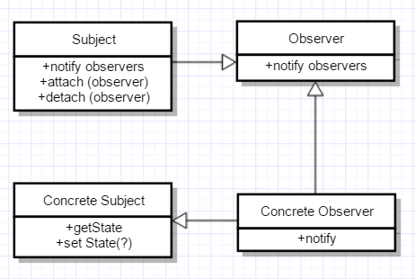
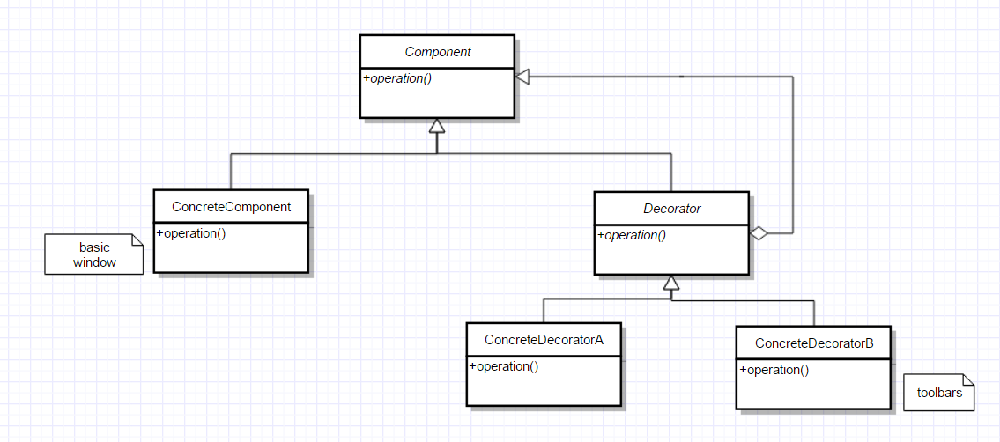
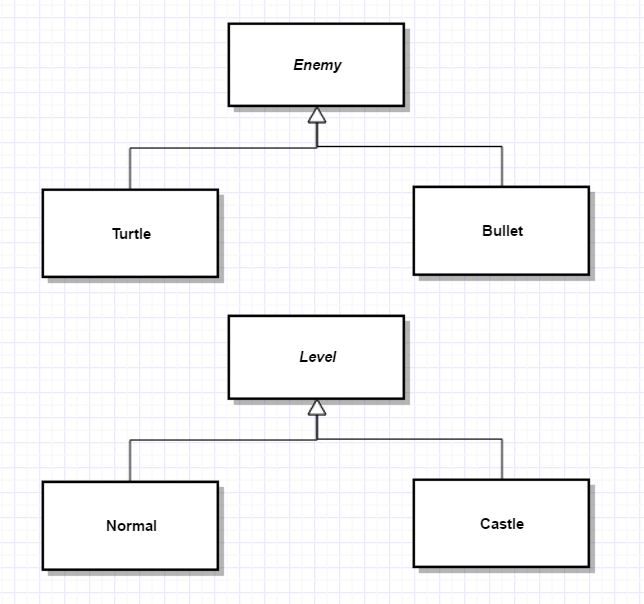

# CS246 Lec. 1

### Graphical shell

- launch programs
- unteract with files/folders
- user interface

### Command shell

- text
- launch programs
- etc.

command prompt - win

terminal -mac

bash - Linux

### Commands

Examples

- pwd - print work dir
- cd - change dir
- ls - list
- wc - 
- man - manual

Control signals

- Ctr+D EOF
- Ctr+C break

Input redirection 

- cat filename - cat opens, reads, closes file
- Cat - waits for input from shell (bash)
- cat < input.txt -shell redirects input to the command
- head number - opens and read first number lines of file

Output redirection

- \> redirect output
- it creates or overwrite a file
- \>> append 

RegEx

- \* wild card
- ? any single char
- [] terms

Redirection

- stdin(<) -> program -> stdout(>)/stderr(2>)

## Pipes

taking output from one program using as input for another

use `|` to pipe, eg: 

```
sort words | uniq | wc -w
```

# Pipe

use output from one command as input for another command 

`cmd1 | cmd2 | cmd3 `

eg: 

`cat myfile | wc -w`

`cat words | sort | unique`

- can also use output from one command as parameter

`echo "abc"`


# RegEx

### Pattern matching

`*` - filename match any number of chars

- eg: ls *.txt

`?` - match single character 

- eg: ls sample?.txt

**Regular Expression**

- pattern for matching a string
- eg: web validation in JavaScript, text editor

### egrep (grep)

`egrep <condition> <file>` process the file one line at a time, print out lines matches the condition

eg: `egrep "cs246" index.html`, it will find lines contain string "cs246"

### regex rules

`()` to create a sub-expression

- eg: `(cs|CS)246` matches cs246 or CS246

  `(c|C)(s|S)246` matches cs246 or CS246 or cS246 or Cs246

`[]` match any one cha in brackets

- eg: `[cC][sS]246` cS246

  `[a-z][0-9]` can use for ranges

  `[^0-9]` single char *not* 0-9

  `[^A]`  *not* A

`.` - single character

`^` - start of file

`$` - end of file

### frequency of characters

`?` - 0 or 1 of preceding pattern. eg: `A?` 

`*` - 0 or more of 

`+` - 1 or more 


**eg:**

`egrep ".*" file.txt` any string

`egrep "^cs246" file.txt` match string "cs246" at start

`egrep "^.+$" file.txt`

`egrep "^(..)*$" file.txt` lines of even length


**sample questions:**

list files in curr dir whose name contains a single "a"

`ls | egrep "^[^a]*a[^s]*$"`

fetch words from global dict that start with "e" and consist of 5 chars

`egrep "^e....$"`


# File System

- files and directories structured in a tree

- top node is called root

- reference file / directories by their position in tree

  - eg: /u4/hello - absolute path specified relative to that

- every file can be specified with absolute path

- "working dir" 

  - directing that shell is using
  - can **point at** any directory
  - cd - other dir 
  - pwd - print curr dir

- **Relative path** - path to file or dir relative to working dir

  - for relative paths - `.` represent current dir and `..` represents parent dir

- | d                           | rwx rwx rwx     | 1          | h79sun | h79sun | 25    | Sept.9   | file.txt |
  | --------------------------- | --------------- | ---------- | ------ | ------ | ----- | -------- | -------- |
  | type: **-** file, **d** dir | permission bits | hard links | owner  | group  | bytes | mod date | name     |

In Unix, every file has 

- owner - primary user for this file (creator) and has all permissions

- group - set of one or more users with specific permissions

- | rwx          | rwx          | rwx   |
  | ------------ | ------------ | ----- |
  | user (owner) | group member | other |

  permission bits

- meanings of permission bits

| bit  | file                          | dir                                      |
| ---- | ----------------------------- | ---------------------------------------- |
| r    | file contents can be read     | dir contents can be read, eg: ls         |
| w    | file contents can be written  | dir contents can be modified, eg: create a new file |
| x    | file can be executed as a pro | dir contents can be navigated, eg: cd in to do "stuff" |

### chmod - set permissions on file or dir

|chmod|u|+|r|
------|
||g|-|w|

# Permissions

| rwx  | rwx  | rwx  |
| ---- | ---- | ---- |
| u    | g    | o    |

- file permissions- apply to the file
- dir permissions - apply to dir **contents**
- what if they conflict?
  - will follow the most restrictive set of permissions

# Shell Scripts

### scripts programming

- File containing a set of **shell commands **, executed as programs

#### first. bash

- `#!/bin/bash`   -- can be used to print date, current user, work dir, etc. "she-bang"
  - have to make sure that the file is executable (`chmod u+x <filename>`)

#### Variables

- `x=1` note: without space chars. command sets x=1
- `echo $x` prints value of x
- `echo ${x}` avoids ambiguity, such as `${abc}` and `${a}bc`
- Variables are strings
- `" "` bash expands variables in double quotes: eg: `${PATH}`expands
- `' '` single quote are used for literal

#### Special variables in a script

- do not apply to command line
  - `$1` - represents first command line arg
  - `$2` - represents second command line arg
  - `$0` - name of script
  - `$?` - status of last executed program

**Examples**

check if a word is in the dictionary

```bash
./isItAWord word
isItAWord.bash
#!/bin/bash
egrep '^$1$' /user/share/dict/words
```


check if a word is a "good" password

```shell
if [ condition ] ; then
	...
elif
	...
else
	...
fi
# require space around square brackets []
```


```shell
#!/bin/bash
egrep '^$1$' /user/share/dict/words > /dev/null # /dev/null through away stdout
if [ $? -eq 0 ] ; then
	echo "Bad password"
else
	echo "Good password"
fi
```


Verify number of arguments

```shell
#!/bin/bash
usage() {
  echo "usage: $0 password"
}
if [ $# -ne 1 ] ; then
	usage
	exit
fi
```


## Variables in bash are strings

- can be manipulated as integers or strings

- choice of operator tells bash how to process

- | as integers                 | as strings         |
  | --------------------------- | ------------------ |
  | `-eq` equals                | `=` equals         |
  | `-ne` not equals            | `!=` not equals    |
  | `-lt` less than             | `<` "less than"    |
  | `-gt` greater than          | `>` "greater than" |
  | `-le` less than equal to    |                    |
  | `-ge` greater than equal to |                    |

## Loops

- eg: print numbers from 1 to $1     `./count 10`

```shell
#!/bin/bash
x=1
while [ $x -le $1 ]; do
	echo $x
	x=$((x+1)) 
done
```

eg: iterating over a list (of strings, separated by spaces)

- rename a group of files from .cpp tp .cc

```shell
#!/bin/bash
for name in *.cpp; do
	mv ${name} ${name%cpp}cc
done
```

eg: how many times a word($1) occurs in a file (\$2)

```shell
#!/bin/bash
x=0
for word in $(cat $2); do
	if [ $word = $1 ]; then
		x=$((x+1))
	fi
done
echo $x
```

```shell
#!/bin/bash
for j in $(ls); do
	echo "item $j"
done
```


eg: Payday is on the last Friday of the month, compute this month's payday

syntax: ./payday


```shell
#!/bin/bash
answer(){
  if [ $1 -eq 31 ]; then
  	echo "This month: the 31st"
  else
  	echo "This month: the ${1}th"
  fi
}
answer $(cal | awk '{print $6}' | egrep [0-9] | tail -1)
```

`./payday` -- current month

`./payday march 2016` -- some other month

------

`./payday` -no cmd line args

​			$1 - date

​			$2 - nothing


**functions cannot access command-line arguments **


# Testing

- essential part of software development
  - ongoing - not just at the end
  - begin *before* you start coding -- understand requirements and behaviours
  - should be building "test suits" -- set of tests that document expected behaviour
- testing is not debugging -- testing needs to be systematic and reproducible
- testing cannot guarantee correctness
  - can only prove "wrongness" -- ie. match expected behaviour
- ideally, you should have a separate tester. ie. dev/tester are different
  - bias exist, want it to be objective


### Human testing vs. machine testing

- Human testing 
  - people look at your code, find flaws
  - include code inspections, walkthroughs
- Machine testing
  - run program with selected input, check against expected output
    - check expected behaviour
    - cannot check everything - choose test cases carefully
  - type: black box/grey box/white box
    - black-box: testers have no knowledge of internals - 
    - grey-box: some limited access to implementation
    - white-box: full access to implementation/complete knowledge
- start with black-box
  - check various classes of input.  eg: numeric, +/-
  - boundaries of valid ranges ("edge cases"). min/max value
  - mult. simultaneous boundaries ("corner cases")
  - extreme cases - outside expectations - give binary file instead of int
- white-box testing to supplement
  - ensure execute all logical paths in a program (complete?) - add more test cases
  - make sure every function runs

# C++

invented in 1979 by Bjarne Stroustrup

- working with simula (00 lang)
- add 00 features of similar to C
- "C with Classes" C++ 1983
- C++14 standards are used. C++17 is on its way

```c
# include <stdio.h>
int main() {
  prinf("Hello world \n");
  return 0;
}
```

```c++
# include <iostream>
using namespace std;
int main() {
  cout << "Hello world" << endl;
  return 0;
}
```


- main must return an `int` in C++
- c++ I/O -uses a header `<iostream>`
- output:
  - `std::cout << ... << ... << std::endl`
- `namespace` is a way of grouping (functionality)
- `using namespace std;` lets us say `cout`/`endl` without say `std::cout` / `std:: endl`
- return statement -returns a status code ($?)
  - if return statement is left out, main will return 0;

### Compile

In the student.cs env.

`g++-5 -std=c++14 program.cc -o program`


### Input / Output

- I/O streams
  - cout - printing to standard output (stdout)
  - cin - reading from standard in (stdin)
  - cerr - printing to standard error (stderr)
- I/O operators 
  - `<<` put to. eg: `cout << x;`
  - `>>` get from. eg: `cin >> y;`
- eg add two numbers

```c++
# include <iostream>
using namespace std;
int main() {
  int x,y;
  cin >> x >> y;
  cout << x+y << endl;
}
```


- `cin` ignores whitespace 
- `cin >> x >> y` get two integer from cin assign to x,y
- what if input does not contain integer? -- error
- what if input terminates early (ctr+D) -- error
- we can check for this 
  - `cin.fail()` -- return true on failure of prev. operation
  - `cin.eof()` -- return true on EOF
  - if EOF is reached, both will be true but EOF is triggered after `fail()`

eg: read all ints from stdin and echo one per line stop on bad input or EOF

```c++
# include <iostream>
using namespace std;
int main() {
  int i;
  while (true) {
    cin >> i;
    if (cin.fail()) break;
    cout << i << endl;
  }
}
```

**Read ints from stdin and echo one per line**

```c++
int main() {
	int i;
  while(true) {
    cin >> i;
    if (cin.fail()) break;
    cout << i << endl;
  }
}
```

if cin fails on bad input 

- fail bit/
  - cin.fail() is true

if cin fails on EOF

- fail bit 
- EOF bit
  - cin.eof() true

**read ints simplified**

```c++
int main() {
  int i;
  while(true) {
    if (!(cin >> i)) break;
    cout << i << endl;
  }
}
```

```c++
int main() {
  int i;
  while(cin >> i) {
    cout << i << endl;
  }
}
```


**read ints and handle bad inputs**


# Stream Abstraction

eg: file I/O using streams

c

```c
# include <stdio.h>
int main() {
  char s[256];
  FILE *file = fopen("suite.txt", "r");
  while(true) {
    fscanf(file, "%255s",s);
    if(feof(file)) break;
    printf("%s\n", s);
  }
}
```


c++ 

```c++
# include <iostream>
# include <fstream>
using namespace std;
int main() {
  ifstream file {"something.txt"}; //open file stream
  string s;
  while (file >> s) {
    cout << s << endl;
  }
}
```


last class: default function parameters

see git, `lectures/c++/functions/default`

```c++
void printSuit(string name = "suit.txt"){
  ...
}
```


## Function Overloading

in C:

```C
int negInt(int n) {return -n;}
int negFloat(float f) {return -f;}
int regBool(bool b) {return !b;}
```

in C++:

function can have the same name, differ only by parameter lists

```c++
int neg(int n) {return -n;}
int neg(float f) {return -f;}
int reg(bool b) {return !b;}
```

- compiler uses the umber and type of parameters to figure out which function to call
  - must differ in arguments not just return type

eg:

```c++
bool neg(int a);
int neg(int a); // will not work (very difficult for compiler)
```

```c++
cout << x
```

`cout` - i/o stream

`<<` - function

`x` - int/float/string


## Constants

```c++
const int x = 5; // cannot reassign, must be initialized
const int y; // BAD :(
```


## Structures (Struct)

```c++
struct Node { // a node in linked list 
  int data;
  Node * next; // in C, struct Node - struct keyword not needed here in C++
}; // ";" at the end :D
```

initializing structs:

```c++
Node n1 {5,nullptr}; // assigns values to members of struct in-order
```

`nullptr` - new in c++, replaces NULL for pointers (c)

`Node n2 = n3; // copy data in n3 to n2 `

`const Node n4 = n1; // n4 cannot be changed`  


## Parameter passing

recall:

```c++
void inc(int n) {n++;}
int x = 5;
inc(x);
cout << x << endl; // 5
// pass-by-value
```

pass-by-value 

call-by-value

- `inc()` gets a copy of the parameter x, and increments the copy
  - original is not changed

pass-a-pointer

- if you want to modify the original

eg:

```c++
void inc (int *n) {
  *n++; // original data is modified
}
int x = 5;
inc(&x); // x's address is passed by value
cout << x << endl; // 6
// pass-a-pointer
```

c++ has another pointer-like type:

## Reference

- sort of like an alias to a variable

```c++
int y = 10;
int &z = y; // z is an l-value reference to an int y
		   // like int *const z = &y;

cout << y; // same IO
cout << z; // same IO
z = 5;
cout << y; // 5
```

l and r-values: 

`int x = 5`

`int x` l-value, have an address

`5` r-value, may or may not have an address


Things you cannot do with l-value references (&)

- cannot leave them uninitialized (ie, `const`) 
- must initialize with something that has an address (l-value), basically refs are pointers.

eg: 

```c++
int &x = 3; // BAD :( - NO ADDRESS
int &x = y + z; // BAD :( - NO ADDRESS
int &x = y; // OK :)
```


- cannot create a pointer to a reference (ie. ref doesn't have own address)

eg:

```c++
int &*x; // BAD ptr to ref
int *&x; // OK  ref to ptr (ie. alias to a pointer)
```

- cannot create a reference to a reference
  - `int && x; // BAD` -- `&&` meaningful but not here
- cannot create an array of references 
  - `int &r[3]= {a,b,c};` -- use pointers

What are they good for?

function pointers

```c++
void inc (int &n) { // pass by reference
  n = n + 1; // no de-referening required
}
int x = 5;
inc(x); // no address pointer
cout << x; // 6
```

eg: overloading `cin` and `cout`

```c++
cin >> x; // takes parameters as references
std::istream & operator >> (std::istream & in; int &n);
```

`std::istream &` return cin

`operator >>` function 

`std::istream & in;` cin

`int &n` x

overloaded for different types: `com >> int` `com >> float` `com >> String` ...


## Cost / Performance

pass-by-value (eg:` void f(int n)`) copies its arguments

- so if the argument is big this can be costly - memory and time to allocate

eg:

```c++
int f(int n) {...} // cheap!
struct RreallyBig {...}; // 1GB
int g(ReallyBig bg) {...} // huge cost
```

pass-by-reference 

- avoids these costs
- arg so does pass-by-ptr

eg:

```c++
int g(ReallyBig &bg) {...} // faster
						 // risk - data is exposed reference to original
```

eg: 

```c++
int h(const ReallyBig &bg) {...} 
```

advice: 

prefer pass-by-const ref when possible 

- all read-only parameters should be this

exceptions?

- passing a single int/bool
- want a copy - pass-by-value

***Strange Behavior of Reference***

```c++
int f(int &n) {...}
int g(const int &n) {...}
f(5); // NO! not an l-value
g(5); // OK??? creates a temp space in memory
```


## Dynamic Memory

in C:

```c
int *p = malloc(1*sizeof(int)); // # of bytes
free(p);
```


in C++:

- use new, delete operators instead
- type-aware -- less error-prone

```c++
struct Node {
  int data;
  Node *next;
};
Node *np = new Node; // allocates space for Node
delete np;
```


```c++
int x;

Node *np = new Node;
```


- all local variables reside on stack 
- variables are de-allocated when they go out-of-scope (eg: function returns)
- allocated memory resides on the heap
- remains allocated until delete us called 
  - if do not de-allocate? memory leak - BAD :( - exhaust memory, fragmented, crash.

## Array form

```c++
Node *myNodes = new Node[10];
delete [] myNodes; // if no [], will delete one Node and result in memory leak
```

- do not mix up with new/delete

```c++
Node getMeANode() { // creates uninitialized node
  Node n; 
  return n; // returns on stack - maybe expensive
}

// return a pointer/ref
Node* getMeANode() { // returns invalid pointer
  Node n;
  return &n;
}
```


```c++
struct Node {
  int data;
  Node *next;
};
Node *np = new Node;
// *np is in stack and Node is in heap
delete np;
```


- stack-allocated variables are auto deallocated when they go out of scope (eg: function returns)
- heap-allocated memory is ***not*** auto deallocated - must ~~delete~~ it !

stack allocation

*expensive* code

```c++
Node getMeANode() {
  Node n; // stack-local
  return n; // copies Node n back to callers stacke-frame
}
int main() {
  Node q = getMeANode(); // gets a copy from function, maybe "expensive" to copy
}
```


return a pointer

BAD code

```c++
Node *getMeANode() {
  Node n;
  return &n; // Node descarded on return, invalid address - BAD
}
int main() {
  Node *q = getMeANode(); // will get random stuff
}
```


GOOD code

```c++
Node *getMeANode() {
  Node *np = new Node; // create on heap, dynamic - GOOD
  return np; 
}
int main() {
  Node *q = getMeANode();
  ...
  delete q;
}
```


```c++
Node *getMeANode() {
  Node *np = new Node; 
  return *np; // you can return a reference from a function - but becareful!
}
int main() {
  Node q = getMeANode(); // ?
  Node &q = getMeANode(); // no idea that we need to delete it or not
  ...
  delete q;
}
```


## Operator Overloading

- defining operators for types that we create 

eg: adding 2 nodes add 2 vectors 

```c++
struct Vec {
  int x,y;
};
```

want to be able to add(+) and multiply(*) by a scalar

```c++
// Vec v1{1,2};
// Vec v2{3,4};
// Vec v3 = v1+v2; // v3{4,6}
Vec operator+ (const Vec &v1, const Vec &v2) {
  Vec v{v1.x+v2.x,v1.y+v2.y};
  return v;
}

// Vec v4 = 2*v3; // v4{8,12}
Vec operator* (const int k, const Vec &v) {
  return {k*v.x,k*v.y}; // OK - compliers knows it is a Vec
  					  // since the return type is indicated above
}

v4 = 2*v3; // OK
v5 = v3*2; // Not OK
Vec operator* (const Vec &v, const int k) {
  return k*v;
}
v6 = v4*2; // OK
```


### Overloading `<<` and `>>`

```c++
struct Grade {
  int theGrade;
};
// cout - eg cout << grade;
ostream & operator << (ostream &out, const Grade &g) {
  out << g.theGrade << "%";
  return out;
}

// cin - eg: cin >> grade >> x >>

istream & operator >> (istream &in, Grade &g) {
  in >> g.theGrade;
  if (g.theGrade < 0) g.theGrade = 10;
  if (g.theGrade > 100) g.theGrade = 100;
  return in;
}
```


## Preprocessor

- Transform code before the compiler sees it


- `#...` - preprocessor directive - eg. `#include <iostream>` 
- including C headers: new naming conversion 


- `# define VARIABLE VALUE`
  - sets a preprocessor variable 
  - not type-safe
  - preprocessor just does search/replace
- eg:`#define MAX 10` 


- `# define VARIABLE` - no value, but "exists" as a "flag"

how do we use this?

- condition compilation - include / exclude source code based on a flag

```C++
# define BBOS 1
# define IOS 2
# define OS IOS
# if OS == BBOS
long long int key; // discards code block under IOS, keep that under BBOS
# elif OS == IOS 
short int key; // vice versa
# elif ...
cout << key;
# if 0 ...
# endif
```


```c++
int main() {
  cout << X << end; // preprocessor for x?
}
```

`g++ -DX=15 defines.cc -o defines` 

- `-D` directive
- `X=15` define X=15 

eg: including / excluding debugging comments

```c++
int main() {
#if def DEBUG
  cout << "settag x=1" << endl;
# endif
  int x = 1;
  while (x<10) {
    ++x;
    #if def DEBUG
    	cout << "x=" << x << endl;
    #endif
  }
}
```

`g++ debug.cc -o debug`

`g++ -DDEBUG debug.cc -o debug` 


## Separate Compilation

- split program into compostable modules module having 
  - interface - type definitions, function prototypes (header files - .h files)
  - implementation - full implementation of code (source - .cc files)
- recall: 
  - declaration - asserts existence of something 
  - definition - fill details, allocates memory 

```c++
// vec.h (header)
struct Vec {
  int x,y;
};

Vec operator+(const Vec &v1, const Vec &v2);
Vec operator*(const int k, const Vec &v);
Vec operator*(const Vec &v, const int k);
```

```c++
// main.cc
# include <vec.h>
int main() {
  Vec v1 {1,2};
  Vec v2 {2,3};
  Vec v3 = v1+v2;
}
```

```c++
// vec.cc 
# include <vec.h>
Vec operator+(const Vec &v1, const Vec &v2) {
  ...
}
...
```


```c++
#include "stdio.h" // look into local dir
#include <vec.h> // look into system
```


```c++
// vec.h
struct Vec {
  int x,y; // declar
};
```

```c++
// vec.cc
#include <vec.h>
...
```

```c++
// main.cc
#include <vec.h>
...
```

Issue: wont compile

- vec.cc - missing main
- main.cc - missing vec implementation 

Processer -> compiler -> linker

- pass through src code
- compiler: compile each independently 
- linker: puts all together

`g++14 -c main.cc // main.o` 

`g++14 -c vec.cc // vec.o`

`g++14 main.o vec.o -o main // exe` 

vec.h? - do not compile this


## Global Variable

eg. variable 

```c++
// intuitive 
// abc.h
int globalNum; // decl + definition
```

- cannot just include in header - source files each get their own def'n 

```c++
// abc.h 
extern int globalNum; // declaration only (defined elseware)
```

```c++
// main.cc
#include <abc.h>
int main() {
  int globalNum = 5; // definition - one source file only
}
```


eg. linear algebra module using vector class

BAD

```c++
// linalg.h
#include <vec.h>
...
```

```c++
// linalg.cc
#include <linalg.h>
#include <vec.h>
```

```c++
// main.cc
#include <vec.h>
#include <linalg.h>
int main() {
  ...
  Vec v;
  ...
}
```

- this will not compile 
  - main.cc, vec.cc each gets multiple copies of vec.h
  - problem ? struct (Vec) is defined multiple times - BAD
- issue -need to prevent headers from being included multiple times
- sol'n 1 - be careful -- i.e manually track dependencies -- nearly impossible 
- sol'n 2 - header guard / include guard

eg. include guard for vector

```c++
// vec.h
#ifndef _VEC_H_
#define _VEC_H_
struct Vec {
  int x,y;
}
#endif
```

guidelines

- always use an include guard in header files
- **never,ever** put `using namespace std` in a header file

# Classes

- "big innovation" in OOP
- idea that structs can also have functions(behavior) 
  - data + behavior (in a struct)

def'ns 

- class 
  - struct type that can potentially contain functions 
- object 
  - an instance of a class
  - **member variables **- instances of variable for an object 
  - **member functions **- functions inside a class

eg. 

```c++
struct Student {
  int assns, mt, final_grade;
  float grade() {
    return 0.4 * assns + 0.2 * mt + 0.4 * final_grade;
  }
};
```


- grade() is a function that can be called 
- assns, mt, final are member variables that hold values for an instance of student
- `Student billy {70,80,22}; // assns,mt,final`
- `cout << billy.grade(); // uses Billy's data`

Formally:

- methods take an extra "hidden" parameter, called ***this*** which is a pointer to the instance of a class
- can rewrite like this:

```c++
struct Student {
  int ...;
  float grade() {
    return 0.4 * this->assns +
    	0.2 * this->mt +
    	0.4 * this->final_grade;
  }
};
```


Initializing objects 

```c++
Studentt billy {70,80,90};
// numbers are assigned ti data members in order
// 70 -> assns
// 80 -> mt
// 90 -> final
```


define a method for initialization - constructor 

```c++
struct Student {
  int assns, mt, final_grade; // same
  float grade() {...}
  Student (int assns, int mt, int final_grade) {
    this->assns = assns;
    this->mt = mt;
    this->final_grade = final_grade;
  }
};

Student billy {60,40,12}; // calls constructor for int
```

- if a constructor is defined, this calls the constructor
- if a constructor is not defined, direct initialization

### uniform initialization

- different forms of initialization, same effect

```c++
int x = 5;
string s = "hello";

int x {5};
string s {"hello"};
Student jane {95,85,98};
```


advantage of constructors

- default parameters can be applied/used
- overloading 
- sanity checks
- logic

default constructor

- if you dont define any constructors the compiler will create one for you
- default - no argument constructor 
  - eg. Student() i.e no argument passed
- what does default do?
  - default constructs objects 
  - get the effects to direct init.

```c++
sturct Student {
  int assns, mt, fi;
  float grade() {...}
}; // no constructor, just default
Student rena; // struct allocate call default constructor
Student tennie {10, 20, 30}; // default, initializes
```


# Using GDB

GNU debugger

part of GCC suite (g++)


To use it:

1. g++14 -g main.cc -o main
   - -g: flag
2. gdb main
3. do stuff with it
   - list
   - break
   - step
   - set

try to google: GDB cheat sheet for more commands 


### Constructors

- the compiler defines a no argument default constructor
- will ***not*** create one if you define any constructor

initializing consts & refs

```c++
struct Strudent {
  int assns, mt, final;
  const int id;
  ...
  
};
```

dilemma: 

1. need to init constant when declared (can't reassign value)
2. but every instance of `Student` needs a unique id

#### When do we init id?

how does an object get created?

1. spare/memory gets allocated
2. fields are constructed. eg. `int assns = 0`
3. constructor body runs <- too late to init constants 

how do we initialize const in step 2?


### Member Initialization List (MIL)

- allows initialization before ctor (constructor) body

```c++
struct Student {
  int assns, mt, final_grade;
  const int id;
  Student (int id, int assns, int mt, int final_grade): id{id}, asns{assns},
  int{mt}, final_grade{final_grade}
  {
    
  }
  // name {inside} : parameter
  // name outside{} : field
}
```


Guidelines:

1. you can and should initialize any fields this way
2. Fields are initialized using the MIL in the order they appear in the class

eg.

```c++
struct Student {
  int final_grade, mt, assns;
  const int id;
  Student (int id, int assns, int mt, int final_grade)
    : id{id}, assns{assns}, mt{mt}, final_grade{final_grade}
  {
    
  }
}
```

tip: just use MIL for init

- more complex code goes in ctor

1. the MIL can be more efficient then initializing in the body of the ctor

   - for fields that are objects and ***not*** in the MIL, they will get default-constructed(and the npotentially initialized again in the ctor body)

2. ***EMBRACE*** MIL, use it!

3. What happens if a field is initialized both in the class and MIL?

   - MIL wins
   - ie. initialization in MIL takes precedence over field init

   eg.

   ```c++
   struct Vec {
     int y = 0;
     const int x = 0;
     Vec(int x, int y): x{x}, y{y} {
       ...
     } // MIL is applied before const int x = 0;
     // so MIL will take the effect
   };
   ```

Constructor:

```c++
Student billy {55,60,70};
Student bobby = billy;
```

how does initialization happen for bobby?

- copy values from fields in billy to fields in bobby
- **copy constructor** - used when one object is initialized as a copy of another object

Every class cares with :

1. default ctor(default constructs all fields that are objects; not created if you define any ctor)
2. copy ctor (just copies all fields)
3. copy assignment operator
4. destructor
5. move ctor
6. move assignment operator

#### copy ctor - copies values

to build your own:

```c++
struct Student {
  int assns, mt, final_grade;
  Student(int assns, int mt, int final_grade): assns{assns}, mt{int}, final_grade{final_grade} {
    
  }
  
  Student(const Student &other): assns{other.assns}, mt{other.mt}, final_grade{other.final_grade} {
    
  }
};
// this is equiv to the default copy constructor
```


When do the default copy ctor fail? A: **dynamic memory**

```c++
struct Node {
  int data;
  Node *next;
  Node(int data, Node *node): data{data}, next{next} {
    
  }
};

Node * n = new Node{1, new Node{2, new Node{3, nullptr}}}; // LL of 3 nodes
Node m = *n; // copy
Node *p = new Node{*n}; // copy
```


stack         heap

n   | -|>     |1|-|> |2|-|> |3|/|

m |1|-|               >

p |-|>        |1|- |>


`m` copied the first node of n in heap and stored in stack. next is pointing to the 2nd node of `n` in heap

`p` creates a new pointer in stack, pointing to a copy of the first node of  `n` in heap, and next is point to the 2nd node of `n` in heap

- copying values like *this* is a "shallow copy"
- we want to **deep** copy that copes the whole list

```c++
struct Node {
  ...
  Node(const Node &other): data{other.data}, next{other.next ? new Node{*other.next} : nullptr} {
    
  }
}
```

When is a copy ctor called?

1. when an object is initialized by another object
2. when an object is passed by value
3. when an object is returned from a function

\* be careful with ctors that take a single parameter

```c++
struct Node {
  ...
  Node(int data): data{data}, next{nullptr} {
    
  }
};
```

- single -argument ctors can lead to implicit behavior

eg

```c++
Node n(4); // OK - calls ctor
Node n = 4; // Compiler: hmm... - maybe you want a Node? implicit conversion from int -> Node
int f(Node n) {
  ...
}
f(4); // implicit - ok!
```


```c++
struct Student {
  explicit Node(int data): data{data}, next{nullptr} {
    
  }
}
```


## Destructor

- is called when an object is destroyed 
  - stack-allocated: goes outof scope 
  - heap-allocated-delete
- every class has its own dtor

Sequence of steps when object destroyed

1. the destructor body runs
2. dtor are invoked for fields that are objects - reverse order
3. space is deallocated 

Why do you need a dtor?

- dynamic memory

```c++
struct Node{
  ...
  Node() {delete next;}
  ...
}
```


Recap:

Destructors 

- method called destructor runs when an object is destroyed 
  - stack allocated - out of scope
  - heap allocated - `delete`
- form 

```c++
~ Student() {
  ...
}
```

- sequence 
  1. dtor called for object
  2. dtor called for fields that are objects 
  3. space reclaimed
- default dtor - just invokes dotrs for fields that are objects 
- why do you need to write own ones? - ***dynamic memory***

eg

```c++
void foo() {
  Node *np = new Node; // stack - np will be destroyed b/c on stack
  ... // anything in heap will leak memory
}
 void bar() {
   Node * np2 = new Node; // np2 - stack
   ...
   delete np2; // leaks memory  the first Node is freed but others linked to it is not
 }
```


```c++
struct Node {
  ~ Node() {
    delete next; // dtor
  }
  int data;
  Node *next; 
}

Node *np = new Node;
...
delete np;
```


## Copy Assignment Operator

```c++
Student billy {30,45,50}; // ctor
Student jane = billy; // copy ctor - initializing from a copy
Student joey; // ctor
joey = billy; // copy assignment - after initialization
```

- classes have a default copy assignment operator
  - does a shallow copy
- when do you need to write your own copy-assign operator?
  - dynamic memory

```c++
struct Node { // attempt #1
  ...
  Node &operator = (const Node &other) {
    data = other.data;
    delete next;
    next = other.next ? new Node{*other.next} : nullptr;
    return *this;
  }
};
```

- why is this problematic? - what if we do this: 

```c++
Node n;
n = n; // self-referencial comparisions
	   // end up deleting this.next other.next
	   // bad - deleted data
```


While writing operator, always check for self-assignment

```c++
struct Node {
  int data;
  Node *next;
  Node &operator= (const Node &other) { // attempt #2 - fixes self-assignment
    if (this == &other) return *this;
    data = other.data;
    delete next;
    next = other.next ? new Node{*other.next} : nullptr;
    return *this;
  }
};
```


other issues?

1. what if `other` points to a node in my list?
   - can inadvertently delete other's list
2. what if new fails? we have freed old data before new node is created - data loss
   - data loss
   - ideally, delete old data **last** 

```c++
struct Node {
  ...
  Node & operator = (const Node &other) { // attempt #3
    if (this == &other) return *this;
    Node *tmp = next;
    next = other.next ? new Node{*other.next} : nullptr; // OK. if new fails here, function will return
    data = other.data;
    delete tmp;
    return *this;
  }
};
```


- copy & swap idiom

```c++
#include <utility>
struct Node {
  ...
  void swap(Node &other) {
    using std::swap;
    swap(data, other.data);
    swap(next, other.next);
  }
  Node &operator= (const Node &other) {
    Node tmp = other; // copy ctor
    swap(tmp); // swap with tmp
    return *this; // tmp stack allocated - when it goes out of scope, tmp is destroyed - and old data with it
  }
};
```


## R-value & R-value References

`int x = 5` 

`int x` l-value have an address 

`5` r-value anything not an l-value


consider 

```c++
Node n{1, new Node{2,nullptr}};
Node m = n; 
Node m2;
m2 = n; // copy assign

Node plusOne(Node n) {
  for (Node *p = &n; p; p = p->next) {
    ++p->data;
  }
  return n;
}
Node m3 = plusOne(n); // copy ctor
```


- compiler creates temporary objects
  - ie plusOne) returns a temp
  - this is just going to get deleted as soon as the statement ends
- it is *wasteful* to copy from a temporary since we are just going to discard it
  - instead of copying the data from a temp 
- **But** I have to know that my r-value is a temp to steal from it

How do I tell if I have a temp object?

- in c++, an r-value reference (&&) refers to a temp object

eg: Node && - reference to a tmp r-value of type Node

Node & - l-value reference


We can write a version of copy ctor that works with - rvalues (temp object)

```c++
struct Node{
  ...
  Node (Node && ): data{other.data}, next{other.data} {
    other.next = nullptr;
  }
}
```

- so, a **move constructor** steals data from an r-value
- Similarly

```c++
Node n;
m = addOne(n); // temporary object - used by copy assign operator
			  // costly - copy ctor being called, then tmp discarded
			  // steal it instead!
```


- to avoid copy/assign from temp, create a **move assignment operator**

```c++
struct Node {
  ...
  Node & operator = (Node && other) {
    using std::swap;
    swap(data, other.data); // no temp
    swap(next, other.next);
    return *this;
  }
};
// when returns, other is destroyed (tmp) and takes original data
```


- if you don't define a move ctor/move assignment operator, get copy versions instead
- if a move ctor/move assign op is defind, it will replace copy ctor/assignment for r-value references (temps)


### Constructor

destructor *

copy constructor * , move constructor * (specialized copy constructor),

copy assignment operator * , move assignment operator * (specialized copy assignment operator)

### "Rule of 5"

If you need a custom version of any of *, then you usually need a custom version of ***all 5*** above


# Member Operators

recall: copy assignment (operator = ) is a member fn 

eg:

```c++
struct Vec {
  ...
  vec operator = (const Vec &v); // member of Vec only has RHS 
};
```

- when an operator is declared as a member function, "this takes the place of the LHS argument"

```c++
struct Vec {
  int x, y;
  ...
  vec operator + (const Vec &other) {
    return {x+other.x, y+other.y};
  }; // member of Vec only has RHS 
  Vec operator * (const int k) {
    return {k*x, k*y};
  }
  Vec operator * (const int k, const Vec &other) {
    return {k*other.x, k*other.y};
  }
};

Vec v1;
Vec v2;
Vec v3 = v1 + v2; // operator +
Vec v4 = v3 * 55; // operator *
Vec v5 = 2 * v4; // scalar LHS. Vec RHS

```


### I/O Operators?

```c++
struct Vec {
  ...
  ostream & operator << (ostream &out) {
    return out << x << " " << y;
  }
};
```


So, operator << and operator >> are standalone so that we have the correct operators

cin and cout are LHS, class RHS

- but there are some operators that **must** be member functions:
  - operator `= `
  - operator `[]`
  - operator `->`
  - operator `()`
  - operator `T` (where T is a type)
- side note: Separate Compilation of classes

```c++
// node.h
#ifndef _NODE.H_
#define _NODE.H_
struct Node {
  int data;
  Node * next;
  explicit Node (int data, Node *next = nullptr);
 
  Node (const while &n);
}
#endif
```


```c++
// Node.cc
#include <node.h>
Node::Node(int data, Node *next):data{data}, noext{next} {
  
}
Node::Node(const Node &n): data{n.data}, next {n.next ? new Node {*n.next} : nullptr} {
  
}
// :: scope resolution operator means "in the context of" eg Node method of class Node
```


## constant objects

recall:

```c++
int f (const Node &n)
```

- often pass `const` objects as parameters
- `const` indicate that its fields cant be modified
  - what about member functions?
    - risk of member function changing data (violating const)
- you can call functions on `const` objects if the methods promise not to change data/fields.

```c++
struct Student {
  int assns, mt, final; 
  float grade () const; // will not change data;
}
```

- compiler checks that we only call const methods of `const` object 
- but what if I am profing / debugging 

```c++
struct Student {
  int numMethodCalls = 0;
  float grade() {
    ++nameMethodCalls; // nothing to do with structed data
    return...
  }
}
```

- grade cannot easily be const - can't increment `numMethodCalls()`
- but `numMethodCalss()` only violates physical const (ie. changes bits n memory, but doesn't affect grade)
  - doesnt affect logical constness (grade validity)
- so what to do?
  - we can make the field mutable, can be changed oven if object is const

```c++
struct student {
  ...
  mutable int numMethodCalls = 0;
  float grade() const {
    ++numMethodCalls; // const does not apply to mutable fields
  }
};
```


## Static Members

- numMethodCalls - applies to a single object
- what if I wont to count method calls for the class?
  - or track number of students created?
- **Static members** apply to the class, not the object (and not to any one instance of the class)

```c++
struct Student {
  static int numInstances;
  Student (int assns, int mt, int final):assns{assns}, mt{mt}, final{final} {
    ++ numInstances;
  }
};
int Student::numInstances = 0; // in the .cc file outside of scope of class
```


## Static Member Functions

don't depend on an object either for their existence 

- don't have access to a this pointer
- don't have access to fields
- can access static members

```c++
// student.cc
struct Student {
  static int numInstances;
  Student (int assns, int mt, int final):assns{assns}, mt{mt}, final{final} {
    ++numInstances;
  }
  static void printInstances() {
    cout << numInstances << endl;
  }
};

int Student::numInstances = 0; 
// initialize the static variable outside of class b/c we do not want to reset the value of numInstances to 0 every time we construct it
```

```c++
// main.cc
int main() {
  Student::printInstances(); // 0
  Student billy {70,80,90};
  Student jane {80,85,90};
  Student::printInstances(); // 2
}
```


### Static Member Functions

1. dont rely o an instance of a class
2. don't have a "this" (ie. not necessarily have any instances of this class)
3. really just functions (not member functions)
4. can **only** access static members/fields
   - converse not true, normal member functions can still access static members/fields

# Invariants . Encapsulation

Consider: 

```c++
struct Node {
  int data;
  Node *next;
  Node (int data,Node *next): data{data}, next{next} {
    
  }
  ~Node() {delete next;}
};
```

```c++
int fun() {
  Node n1 {1, new Node {2, nullptr}};
  // n1 is in stack, pointing to a node in heap
  
  Node n2 {3, nullptr};
  Node n3 {4, &n2};
  // n2 and n3 are both in stack, n3 pointing to n2
  // if call delete n3 here, since n2 is not in heap, program is crashed
} // returns
```

- we assumed in the design that `next` was a ptr to the heap
- users did not know this!

**invariant ** - an assumption that must hold true for your program to operate correctly

ie - invariant in this case was that our pointer was either a valid ptr to heap(or nullptr)

- issue: cant generate this invariant (and cant generate correct usage by our user)

## Invariants(recap)

```c++
struct Node{
  int data;
  Node *next;
  //...
  ~Node(){delete next;}
};
```

```c++
int main(){
  Node n1{1, new Node{2, nullptr}};
  Node n2{3, nullptr};
  Node n3{4, &n2};
  //...
  //m3 goes out of scope - destructor 
  //						-delete n2
  //undefined behaviour (segfaults/crashes)
}
```

- issue?
  - nodes allocated on stack
  - n3 — out of scope?
    - dtor — delete n2 — deleting stack - allocated memory
      - undefined behaviour
      - crash!
- we assumed that next would always point to valid mempry on the heap(or nullptr)
  - client tried to use with stack - allocated memory
- invariants — conditions that must be true for our class to work properly/ as expected
- issue? we can't force client to respect our assumptions
  - cannot enforce invariants
  - e.g. stack
    - invariant — last item on the stack is the first item off the stack
    - if a client has direct access to underlying data, puts our invariant at risk

## Encapsulation

- "data hiding"

- we want our client to treat our class as a "black box"

  - should not need to know implementation details
  - client can **only** manipulate our class through provided(public) methods

- "coornerstones" of object-o languages

  ```c++
  struct Vec{
    Vec(int x,y);	//by default methhods are public
  private:		//anything following private cannot be seen
    int x,y;		//   outside of the class
    //...
  public:
    Vec operator+(const Vec &other);	//anything following public 
    									//is accessible to all
    //...
  }
  ```

- By **default**, all members of a struct are public

  - I don't like this — against principles of encapsulation
    - I would prefer things to be private by default

## Class keyword

- identical to a struct <u>except</u> members are <u>private</u> by default

- struct — data only (no methods)

  class — complex (methods)

  ```c++
  class Vec{
    int x,y;	//private
  public:
    Vec(int x,y);
    Vec operator+(const Vec &other);
    //...
  };
  ```

### Recall: Node class, invariant problem

- fix using encapsulation

- write a wrapper class, named list, manages all access to Nodes

  ```c++
  // list.h
  class List{
    struct Node;	//private nested class, accessible only to List
    Node *theList = nullptr;
  public:
    void addToFront(int n);
    int ith(int i);
    ~List();
  }
  ```

  ```c++
  // list.cc
  struct List::Node{
    int data;
    Node *next;
    Node(int data, Node *next):data{data}, next{next}{}
    ~Node{delete next;}
  };

  List::~List(){
    delete theList;
  }

  void List::addToFront(int n){
    theList = new Node{n, theList};
  }

  int List::ith(int i){
    Node *cur = theList;
    for(int j = 0; j < i && cur; ++j)
    {
      cur = cur->next;
    }
    return cur->data;
  }
  ```

- only List can manipulate Nodes, we can guarantee our invariant(i.e. next is always nullptr or a valid pointer to the heap)

  ```c++
  List lst; 	//n elements
  for(int i = 0; i < n; ++i)
  {
    cout << lst.ith(i) << endl;
  }
  ```

  - linear? O(n^2)
  - vary inefficient (vs using a pointer to walk the list)

## SE Topic: Design Patterns

- "Design Patterns" book

- problems recur — are often repeated

  - architectural / design level problems
  - recommended "best practices" for dealing with common problems

- Iterator pattern — designed to solve our exact problem

  ​			     — class manages access to another class

- an iterator is an abstraction of a pointer (in our case, we want it to behave like a pointer into our list)

  - lets us walk the list without exposing pointers

    ```c++
    // list.h
    class List{
      struct Node;
      Node *theList;
      
    public:
      class Iterator{	//public, nested class
    	Node *p;
    public:
      	explicit Iterator(Node *p):p{p}{}
      	int &operator*(){
          return p->data;
     	}
      	Iterator &operator++(){
          p = p->next;
          return *this;
      	}
        bool operator==(const Iterator &other)const{
          return p == other.p;
        }
        bool operator!=(const Iterator &other)const{
          return !(*this == other);
        }
      };
      
      Iterator List::begin(){return Iterator{theList};}
      Iterator List::end(){return Iterator(nullptr);}
    };
    ```

    ```c++
    int main(){
      List lst;
      lst.addToFront(1);
      lst.addToFront(2);
      lst.addToFront(3);
      
      for(List::Iterator it = lst.begin(); it!=lst.end; ++it)
      {
        cout << *it << endl;	//3 2 1
        *it = *it + 2;
      }
    }
    ```

## Automatic type deduction

- compiler infer the type — auto keyword

  ```c++
  for(auto it = lst.begin(); it != lst.end(); ++it)
  {
    //...
  }
  auto i = 5;
  auto s = "string";
  ```

## Range-based for loop

```c++
for(auto n:lst){
  cout << n << endl;
}
```

- Range-based for loops are available in any class c, that:
  1. has methods `begin()` and `end()` that return iterators
  2. the Iterators support
     - operator ++ (prefix)
     - operator !=
     - unary operation *

## Encapsulation(cont'd)

- one (small) criticism of Iterator

  - client can actually create an Iterator
  - `auto it = List::Iterator(nullptr);`

- violates encapsulation

  - we want client to use begin() and end()

- issue is the Iterator's constructor is public

- if you make the ctor private, List can't create Iterators either!

- what do we do?

  - List should have privileged status with Iterator

  - friend — List is a friend of Iterator

    ​	    — keyword that says your friends have access to your private data
    ```c++
    class List {
    struct Node;
    Node *theList;
    public:
    class Iterator {
    Node *p;
    public:
    explicit Iterator (Node *p):p{p} {}
    };
    Iterator begin() {...}
    Iterator end() {...}
    }; // end List
    ```
```


**Recall** : Encapsulation and Friends

**Issues**:

client can do this

`auto it = List::Iterator(nullptr)`

- Iterators should not be able to created directly (as shown above)
  - Cliend should have to call List.begin() and List.end() to get an Iterator. 
  - breaks encapsulation (to allow clients to create Iterators directly)
- In making Iterator (and its ctor) visible to list. It's visible and accessible to the client as well
- List needs to be able to create iterators - but nobody else 
  - ie. Iterator ctor is public
  - "special access" called "friend" (private data / stuff)
- fix? Limit ctor so that only List can use it


eg: *using friend*

​```c++
class List {
  ...
  public:
  	class Iterator {
      Node *p; // private by default
      expliit Iterator (Node *p);
      ...
      public:
      	firend class List;
  	};
};
```


so: friends have unrestricted access. List can now create iterators

- client can **only** check Iterators by calling List.begin() and List.end() (because these return Iterators)

so, guidelines for friends:

- with classes, we need as few `friend`s as possible
  - friends violate encapsulation 


- in general - keep friends private
- ***but*** what if you want to give a client access to data?
  - create `public` methods to provide access


ie. accessor methods (return data to clients) ("getters")

```c++
class Vec {
  int x, y;
public:
  int getx() const {return x;} // accessor methods
  int gety() const {return y;}
};
// getters
```


mutator methods - change data in fields (setters)

```c++
calss Vec {
  int x, y;
public:
  int getx() {return x}; // accessors
  int gety() {return y;}
  void setx(int newx) {this.x=newx}; // mutators
  void sety(int newy) {this.y=newy};
}
```


So, what's the point?

1. Separates implementation from public interface/methods
   - protects your external interface (ie. public methods)
   - can change underlying implementation w/o affecting clients
2. validation on data in mutaters (bonds-checking) 
   - reject invalid input in mutaters


So, what's the impact of changes to Vec?

- fields are private - standalone functions cannot access fields directly


eg: what about operator << ?

2. Possibilities

   1. use accessor methods in operator <<

      ```c++
      ostream & operator << (ostream & out, const Vec &v) {
        return (out << v.x << " " << v.y);
      } // BAD. breakes because x and y are private
      ```

      operators previously accessed fields (Vec) that are now private

      sol'ns 

      1. ```c++
         ostream & operator << (ostream & out, const Vec &v) {
           return (out << v.getx() << " " << v.gety());
         } // OK. accessors
         ```

         this works fine if you have accessor methods 

         some classes need these accessors

         ​	other classes, accessors don't make sense (eg: List - `getNode()  // ???`)

      2. can also define operator `<<` as a friend function

      ```c++
      // vec.h
      class Vec {
        ...
      public:
        ...
        friend std::ostream & operator << (std::ostream &out, const Vec &x)
      };
      // new, operator access Vec's private fields
      ostream & operator << (ostream &out, const Vec &v) {
        return (out << v.x << " " << v.y);
      }
      ```

very common - friend functions with operators (standalone functions)


**Tools**  Make:

**recall separate compilation**

```shell
g++14 -c list.cc
g++14 -c node.cc
g++14 -c iter.cc
g++14 -c main.cc  # compilation - produces object files (.o)

g++14 list.o node.o iter.o main.o -o myprogram # Linking - produces executable
```


### Reasons for Sep compilation ?

1. compile in any order, dont worry about dependencies
2. only build what's changed (efficient)
   - ie. single file if needed -> how to track this? 
   - in order to track, automate this process 
     - automate compiling
     - keep track of what's changed and only build that

Create a ***Makefile***  (build config file for make) - command-line tool

- one Makefile per project - text file (named Makefile) 
- Makefile  in the same dir as source

```shell
# comment - builds myprogram
myprogram: main.o list.o node.o iter.o
	g++-5 -std=c++14 main.o list.o iter.o node.o -o myprogram
# dependencies
main.o: main.cc list.h
	g++-5 -std=c++14 -c main.cc
list.o: list.cc list.h node.h
	g++-5 -std=c++14 -c list.cc
node.o: node.cc node.h list.h
	g++-5 -std=c++14 -c node.cc
iter.o: iter.cc list.h
	g++-5 -std=c++14 -c iter.cc
```

usage: 

```shell
$ make main.o
```

go into Makefile, find main.o, if either main.cc or list.h changed, rebuild it

``` shell
$ make target
```

build a specific target (eg. main.o, debug, release)

you can add other targets:

```shell
.PHONY: clean
clean:
	rm *.o myprogram
```

``` shell
$ make clean
$ make
```

remove all temp files and rebuild everything


automation - variables

in Makefile:

```shell
CXX = g++-5
CXXFLAGS = -std=c++14 -Wall
...
iter.o: oter.cc iter.h
	${CXX} ${CXFLAGS} -c iter.cc
```

`g++ -W` flag-"warnings"

Can rewrite as 

`iter.o: iter.cc iter.h`


the biggest problem with Makefiles is tracking dependencies 

- however, g++ can figure out dependencies:
- `$ g++14 -MMD -c iter.cc` 
  - produces iter.o (object file) 
  - and iter.d (dependency file)

```
// iter.d
iter.o: iter.cc iter.h
```


eg. that includes generated dependency files 

``` shell
CXX = g++-5
CXXFLAGS = -std=c++14 -Wall
OBJECTS = main.o list.o iter.o node.o
DEPENDS = ${OBJECTS: .o=.d}
```


# System Modeling 

- designing OO systems
- OO programming - all about abstractions; and relationships between abstractions
- helpful to describe relationships, both for design and implementation
- standard: UML (unified modelling language)


# Lec 14 to be inserted here 


### Destructor (revisited) 

Bad code

```c++
class x {
  int *x;
  public:
  	x(int n): x{new int [n]} {};
    ~x() {delete [] x;}
};

class y: public x {
  int *y;
  public:
    y(int m, int n):x{n}, y{new int []} {}
    ~y(){delete [] y;}
};

X *myX = new y {10, 20};
delete myX;
```

- what is the problem with this code??
  - This leaks memory
  - b/c only `~x` destructor for x runs, that for y never runs
- Q: How do we ensure that the subclass destructor runs, even when using a Base class pointer?
  - A: Declare the destructor virtual - forces the compiler to actually determine the type at runtime

```c++
class x {
  ...
  public:
    ...
    virtual ~x() {delete [] x;}
};
```

Rule -

- always make the destructor virtual in classes that are meant to be subclasses
  - even if it does nothing! b/c the subclass's destructor might do something 
- If you don't want a class to be subclassed, make it `final`

eg: 

```c++
class y final : public x { // ie. yea cannot subclass y
  ...
};
```


## Pure Virtual Methods (Abstract Classes)

eg

``` c++
class Student{
protected:
  int num Classes;
public:
  vitual int fees(); // calculate fees
}

class Regular: public student {
public:
  int fees() override; // calc. regular student fees
};

class Coop: public Student {
public:
  int fees() override; // calc coop student fees
}
```

Q: re Student impl
- what do I do with `Student::fees()` ?
  - I'd like this method to have no implementation ..
  - make it a **pure virtual** method

eg: 
``` c++
class Student {
public:
  virtual int fees() = 0;
}
```

Once you add a pure virtual method to a class, that class canot be instantiated
ie
``` c++
Student s; // error - can only instantiate Regular or Coop
```

- such a class is called an **Abstract Class** 
  - purpose is to serve as a base lass / organize subclasses
  - subclasses of abstract classes are also abstract unless you implement all pure virtual methods
  - classes that can be instantiated (incl. subclasses implementing pure virtual methods) are **Concrete Classes**


**in UML:**
- represent virtual and pure virtual methods in ***italics***
- represant abstract classes with name in ***italics***
  eg:

*Student*
|__Regular
|__Coop


## Templates

recall:

``` c++
class List {
  struct Node;
  Node * theList;
};

struct List::Node {
  int data;
  Node *next;
}
```


Q: what if I want a List that supports something other than int?

A1: copy/paste code into a new class ...

- not scalable / maintainable

A2: to use \<Template\> class 

- A template class is a class that is parameterized by **type**

eg: Stack

``` c++
template <typename T> class Stack {
  int size;
  int cap;
  T * contents;
public:
  Stack() {...}
  void push (T x) {...}
  T top() const {...}
  void pop() {...}
};
```

We can rewrite our List class ad a template :

``` c++
template <typename T> class List {
  struct Node {
    T data;
    Node *next;
  };
public:
  class Iterater {
    Node *p;
    explicit Iterator (Node *p):p{p} {}
  public:
    T &operator*(){...}
    friend class List<T>;
  };
  T ith(int i) {...}
  void addToFront(const T &n) {...}
};
```

possible client code

``` c++
List <int> l1;
List <list<int>> l2;
l1.addToFront(s);
l2.addToFront(l1);
```

``` c++
for (auto it: li) {
  cout << it << endl;
}
```


Compiler generates code for templates, loosed on usage. 


## Standard Template Library (STL)

- originally, this was a set of external libraries for working with templates
  - ie. use templates to add features to c++
  - now included in c++
- eg. Vector - dynamic length array

eg: Vectors

```c++
#include <vector>
using namespace std;
vector <int> v {4,5}; // init with values 4,5
v.emplace_back(6); // 4,5,6
v.emplace(7); // 7,4,5,6
```

- methods to insert, erase...


loop over vectors:

```c++
for (int i = 0; i < v.size(); ++i) {
  cout << v[i] << endl;
}
```

Iterator abstraction:

```c++
for (vector<int>::iterator it = v.begin(); it != end(); ++it) {
  cout << *it << endl;
}

// or

for (auto n : v) {
  cout << n << endl;
}
```


To iterate in reverse:

``` c++
for (vector<int>::reverse_iterator it = v.rbegin(); it != rend(); ++it) {
  ...
}

// or

for (auto it = v.rbegin(); it != v.rent(); ++it) {
  ...
}

v.pop_bacl(); // removes las element
```


Advantage?

- easy to work with - no explicit new/delete to manage it
- vectors are guaranteed to be implemented as arrays
- use whenever you need dynamic - length array
  - avoid vector versions of new and delete

Other vector operators work with iterators - eg erase

``` c++
auto it = v.erase(v.begin()); // erases item 0, return iterator to next item
it = v.erase(v.begin() + 3); // erases 4th item
it = v.erase(it); // erases item pointed to by iterator
it = v.erase(v.end()-1); // erase last item in list
```


```c++
v[i]; // returns ith element - unchecked - 
// eg vector sizes; v[10] 
// fails with unspecified errr(undefined behaviour)

v.at(i); // returns ith element - checked
// compiler has predictable behaviour
```


# Exceptions

What do you do, when errors occur?

Problem:

- vector code (for `v.at[i]`) can detect the errors, but does it know what to do with it?
- the client/program knows what to do, but cannot directly detect error
  - detect errors: local problem "class/function"
  - react to errors: global problem "client"

How does vector tell the program that there's an error?

- **C sol'n**: 
  - return status code from a function
  - or set global value like an `int error`
  - these are not great, encourage programmers to skip errors
- **C++ sol'n**: when an error arises, the function **raises an exception**
  1. (exception is a type of error), by default, the program halts
  2. we can write a handler to **catch the exception**

eg: `Vector <T>::at` raises an exception `std::out_of_range`

``` c++
#include <stdexcept>
try {
  cout << v.at(1000000) << endl;
}
catch (out_of_range) {
  cerr << "Range Error" << endl;
}
```


# Exceptions (cont'd)

Consider:


``` c++
void f() {
  ...
  throw out_of_range("f"); // raise an exception with a parameter
}

void g() {f();}
void h() {g();}

int main() {
  try {
    h();
  } catch (out_of_range) {
    ...
  }
}
```

What happens?

main calls h

h calls g

g calls f

f `throw` ... all the way back to main


Control back through the call chain (unwinds the stack) until a handler is found (for the exception)

- If there is no matching handler, your program terminates 

What is out_of_range? a class

The statement out_of_range("f"} - invokes ctor, with "f" as a parameter (auxil information)


How to examine auxiliary info?

``` c++
try {
  ...
} catch (out_of_range ex) {
  cout << ex.what() << endl;
}
```


A handler can do part of the recovery job. ie.take corrective action and throw another exception.

``` c++
try {
  ...
} catch (someErrorType s) {
  ...
  throw SomeOtherError (...); // new 
}
```

or just throw some exception

``` c++ 
try {
  ...
} catch (someErrorTpe s) {...
  throw;
}
```


### Why do we say throw instead of throw s>

Try exception s maybe a subclsss of SomeErroType , rather than SomeErrorType intself

- throw s - throws a new exception of SomeErrorType 
  - ie. slices the derived class into SomeErrorType
- throw - rethrows the actual exception (of actual type) - no slicing


When throwing/raising an exception, you should try and be specific

But, you can write a handler to capture all


``` c++
try {.....}
catch (...) { // literaly ... - three dots is generic exception handler
  // do something
}
```

``` c++
try {
  // do sth
} catch (exA) {
  //
} catch (exB) {
  //
} catch (...) {
  // default
}
```


You can throw "anything" - doesn't even have to be an object

eg: git: lectures/c++/exceptions - fib - fact (both recursive)

- using exceptions for regular data passing is a bad idea - overhead
- save exceptions for accasional use /exceptional circumstances (like errors)

You can also define your own exception classes

``` c++
class BadInput {};
try {
  int n;
  if (!(cin>>n)) throw BadInput{};
}
catch (BadInput &) { // return exception by reference
  cerr << "badly formed input" << endl; // avoids slicing problem
  									// compiler knews actual type
  									// maxim: "Throw by value, catch by reference"
}
```


Rule: ***Never, ever*** for any reason, ever, 

- never throw an exception from a destructor
  - dtor may be called after an exception is thrown (while going up the call stack)
  - if your dtor throws an exception, then you have 2 unhandled exceptions - program will terminate 


# Design Patterns (cont'd) 

Best - practices for solving common problems

**Guiding Principle**

- program to interfaces, not implementation
- *Abstract base classes* (virtual methods)
  - define the interface
  - work with pointers to abstract base classes, call methods through pointers
  - concrete subclasses can be swapped in /out
- gives us one common abstraction over a variety of behaviours


eg: Iterators

``` c++
class AbatractIterator {
public: 
  virtual int &operator *() const = 0;
  virtual AbstractIterator &operator ++() = 0;
  virtual bool operator== (const AbstractIterator &other) const = 0;
  virtual bool operator!= (const AbstractIterator &other) const {return !(*this == other);}
  virtual ~AbstractIterator();
}

class List {
  struct Node;
  ...
public:
  class Iterator: public AbstractIterator {
    ... // override /implement all virtual methods
  };
};

class Set {
  ...
public:
  class Iterator:public AbstractIterator {
    ...
  };
};
```


Now, I can write functions that work on any data structure with an iterator derived from AbstractIterator

eg: function to apply a Function from arbitrary iterator /data structure

```c++
template <typename Fn>
  void foreach(AbstractIterator start, AbstractIterator end, Fn f) {
    while (start != end) {
      f(*start);
      ++start;
    }
  }
```

this function works over Lists, sets and anything else with an Iterator derived from `AbstractIterator` 


## Observer Pattern

- publish - subscribe (pub/sub)
- model-view-controller

2 entities:

- one publisher
  -  generates data
- one or more observers
  - monitor data 
  - need to know when the data changes 

eg: spreadsheet - cells with data and graphs (cells publisher, graphs observers)

characteristics

- publisher works alone
- add/remove observers
- loosely coupled
- publisher knows very little about observers

**UML**



Sequence

0. Concrete Observer calls subject::attach to register itself; Subject maintains a list of observer * (eg. Vector \<observer*> )
1. Subjects state gets updated (eg. value in a cell changes)
2. Subject notify Observers() calls each observers notify
3. each observer calls concrete subject::getState to get state and react accordingly 


eg: horse racing & betting

subject - publishes the winner

observer - people betting - observe race, declare victory when their horse wins


``` c++
class Subject {
  vector <observer*> observers;
public:
  subject();
  void attach (observer *ob) {
    observers emplace_back(ob);
  }
  void detach(observer *ob);
  void notifyObservers() {
    for (auto &ob: observers) ob->notify();
  }
  virtual ~Subject() = 0; // need to be implemented Subject::~Subject() {}
};

class Observer {
public: 
  virtual void notify()=0;
  virtual ~Observer() {}
}
```

``` c++
class HorseRce: public Subject {
  ifStream in; // source of data
  string lastWinner; 
public:
  HorseRace(string source): in{source} {}
  ~HorseRace() {}
  bool runRace() {return in >> lastwinner;}
  string getState() const {return lastWinner;}
}

class Better: public Observer {
  HorseRace* subject;
  string name, myhorse;
public:
  Better(HorseRace *hr, string name, string myhorse): subject{hr}, name{name}, myhorse{myhorse}
  {  
    subject->attach(this);
  }
  void notify() {
    string winner = subject->getState();
    cout << (winner == myhourse ? "I win! :D" : "I lost :(") << endl<<
  }
};
```

```c++
// main
int main () {
  HorseRace hr {"source.txt"};
  Better Larry {&hr, "Larry", "Runs Like A Cow"};
  
  while (hr.runRace()) {
    hr.notifyObserver()
  }
}
```


**Simplifications**

1. If the state is trivial, you can publish directly in your notify() and eliminate getState()
2. If you *know* that you will only have one single subject, you can merge subject and concrete subject(horserace class)
   - risky, hard to get generalize later
3. If the subject & observer are the same, could merge into one class. eg: cell is .xlsx (in excel)

# Decorator Pattern

- suppose you want to enhance ('decorate') an object
  - add functionality at runtime (vs. compile time)

eg: basic window, enhance by adding menus, toolbars, scrollbars...



The class *Component* defines the interface (ie. operations objects provide)

- concreteComponent - implements

Decorator is a component and has a component 

​	eg: window with a menu is a kind of window, with a pointer to an underlying plain window

Decorators and ConcreateComponent 

- share a base class
- methods can be used polymorphically on them

eg: Pizza


``` c++
class Pizza {
public:
  virtual sloat price() const=0;
  virtual string desc() const=0;
  virtual ~Pizza();
};

class CrustAndSause: public Pizza {
public:
  float price() const override {return 5.99;}
  string desc() const override {return "Pizza";}
};
```

``` c++
class Decorator: public Pizza {
protected:
  Pizza *component;
public:
  Decorator (Pizza *p) : component{p} {}
  virtual ~Decorator() {delete component;}
};

class StuffedCrust: public Pizza {
public:
  StuffedCrust(Pizza *p): Decorator{p} {}
  float price() const override {return component->price+2.65;}
  string desc() const override {return component->desc+" with stuffed crust";}
}

class Topping: public Decorator{
  string theTopping;
public:
  Topping(string topping, Pizza *p): Decorator{p}, theTopping{topping} {}
  float price() const override {return component->price+0.75;}
  string desc() const override {return component->desc+" with "+theTopping;}
}
```


# Factory Method Pattern

**problem**: write a video game, 2 kinds of enemies: turtles bullets

The system randomly sends out enemies, but later levels send out more bullets



Since we never really knew what enemy is being created next, we cannot just call the ctor

- we dont want to hard-code the policy (ie. we want flexibility - difficulty add levels later)

**Factory** method to create enemies for us

``` c++
class Level {
  public:
  virtual Enemy* createEnemy=0;
  ...
};
```

``` c++
class NormalLevel: public Level {
public:
  Enemy* createEnemy() override {
    // create mostly turtles
  }
};
class Castle: public Level {
public:
  Enemy* create Enemy() override { 
    // create mostly bullets
  }
};
```

eg: usage

```c++
Level *l = new NormalLevel;
Enemy *e = l->createEnemy();
```

Factory method or "virtual constructor pattern"


# Template Method Pattern

- we want the subclass to override **source** (but not all) base class behaviour

eg: red and green turtles

```c++
class Turtle {
public:
  void draw() {
    drawHead();
    drawShell();
    drawFeet();
  }
private:
  void drawHead();
  virtual void drawShell()=0;
  void drawFeet();
}

class RedTurtle: public Turtle {
  void drawShell() override {
    // ... draw red
  }
};
class GreenTurtle: public Turtle {
  void drawShell() override {
    // draw green
  }
}
```


### Extension: Non-virtual Interface (NVI) idiom

A public virtual interface is both:

1. an interface to the client
2. an interface to subclasses

# NVI Idiom (Non-virtual interface)

A public virtual method is really 2 things

1. a public interface for the client
2. an interface for subclasses - override to specializing behavior

These 2 things should not be tied

eg: we want to change implementation later without changing public methods


**NVI Idiom States:**

1. all public methods should be non-virtual - client interface (will not change)
2. all virtual methods should be private/protected - specializing derived classes
   - exception: dtor is still public (even if virtual)
   - want dtor to be virtual, but needs to be public


eg: Digital media - Non-virtual
Bad code. Mixing public and virtual method together
``` c++
class DigitalMedia {
public:
  virtual void play() = 0;
  virtual ~DigitalMedia();
};
```
Good code
``` c++
class DigitalMedia {
public:
  void play() {
    doPlay();
  }
  virtual ~DdigitalMedia(); // public interface
private:
  virtual void doPlay()=0; // private and virtual
};
```

If we need extra control (later on) we can claim it
eg: 
-  can add code before/after doPlay to check copyright, update play count
-  we can add more "hooks" for derived classes by. eg: adding other virtual methods to showCoverArt
-  all without changing the public interface


It's much easier to design early than to try and take control later

Basically: NVI puts every virtual methods inside a non-virtual wrapper


# STL Maps
aka hash tables

store a key/value pair in data structure

eg: "arrays" that store string/int

```c++
#include <map>
using namespace std;
map<string, int> m;
```

```c++
m["abc"] = 1;
m["def"] = 4;
cout << m["abc"] << end; // 1
cout << m["ghi"] << emd; // 0
// if the key doesnt exist, compiler will default-construct a pair and return value
```

```c++
if(m.count("def")) {
  cout << m["def"] << endl;
}
m.erase("abc");
for (auto &p:m) {
  cout << p.first << p.second << endl; // p.first is key, p.second is value
}
```

p's type here is `std::pair<string, int>`

- defined in `<utility>`


# Inheritance & copy/move operators

``` c++
class Book {
public:
  //defines copy/move ctor, copy/move assignments
}

class Text:public Book {
  string topic;
public:
  // does not define copy/move ctor or copy/move assignments
}
```

```c++
Text t{"Algorithms", "CLRS", 500, "CS"};
Text t2=t1; // copy stor - but no copy ctor for Text
```

What happens?

- copy init calls Book's copy ctor. and then goes field-by-field for the Text part. ie. default behavior. 
- some is true for other compiler - supplied methods


```c++
Text:: Text(const Text &other): Book{other}, topic{other.topic} {}; // copy ctor
Text &Text::operator=(const Text &other) { //copyt assignment
  Book::operator=(other);
  topic = other.topic;
  return *this;
}
Text::Text(Text &&other): Book{std::move(other)}, topic{std::move(other.topic)} {} //move ctor7
Text &Text::operator=(const Text&& other) {
  Book::operator=(std::move(other));
  topic = std::move(other.topic0);
  return *this;
}
```

These mimic default behavior(ie shallow copy)

Note: even though other "points" to an r-value, other is actually a l-value

- to fore move ctor/assign, we use `std::move` to fore other
- to be treated as an r-value - ie. move versions are used

Now consider

```c++
Text t1 {...};
Text t2 {...};
Book *pt1 = &t1;
Book *pt2 = &t2;
```

what happens if we do: `*pt1 = *pt2;` copy assignment - Book version runs

So, Book::operator = runs;

- problem: topic is nwer assigned - BAD

Partial assignment - base class ptr means base class operator runs

- ie fields not assigned

Fix - make operator= virtual

```c++
class Book {
public:
  virtual Books & operator=(const Book&other) {}
}
class Text:public Book{
public:
  Text &operator=(const Book) override {}
}
```

Note: Text can return a subtype of Book - allowed

but parameters need to be the same (ie. Book & for both)

(if not the same wont compile)

by the is-a principle. b/c a Text is a Book, you can do this

assign of a Book object to a Text object can be done

``` c++
Text t {...};
Book b {...};
Text *pt = &t;
Book *pb = &b;
*pt = *pb
```

Technically works, aka compiles

- but not that useful - init Text from a Book, cannot init topic

Also implies:

```c++
Comic c {...};
Comic *pc = &c;
*pt = *pc; // worse. cannot init Text::topic field also ignoring Commic::hero
```

So, if operator= is non-virtual, then we get *partial assignment* when assign from base class pointers; if it's *virtual*, we get *mixed assignemnt*

### Recommendation:

all superclasses should be abstract


```c++
class AbstractBook {
  string title, author;
  int numPages;
protected:
  AbstractBook &operator=(const AbstractBook &other);
public:
  AbstractBook(...);
  virtual ~AbstractBook()=0;
};
AbstactBook::~AbstractBook(){}
```

- protected operator= prevents assignment through base class pointers from compiling 
  - derived classes can still invoke


```c++
class NormalBook:public AbstractBook {
public: 
  NormalBook();
  ~NormalBook();
NormalBook& operator=(const NormalBook& other) {
  AbstractBook::operatpr=(other);
  return this;
}
}
```

This design prevents both partial and mixed dessign

- can still uses base class pointers for derived classes

# Visitor Pattern

eg: game with turtles, bullets 

- used for implementing double-dispatch
- virtual methods are chosen based on the run-time type of the object
  - but what if you want to choose based on **2** objects?
  - ie pick a virtual method to run based on **2 ** types -double-dispatch

We want something like this:

`virtual void strike(Enemy &e, Weapon &w);`

- of we attach to an enemy, then its tied to the type of enemy

  (ie. choosing based on type of enemy)

  `virtual void Enemy::strike(Weapon &w);`

- similarly, we cannot just attach to the weapon, either

  ie `virtual void Weapon:: strike(Enemy &e);`


The trick to dispatching based on **both** entities (double dispatch) is to combine *overriding* and *overloading*

eg:

```c++
class Enemy {
public:
  virtual void beStruckBy(Weapon &w)=0;
};
class Turtle:public Enemy {
public:
  void beStruckBy(Weapon &w) override {w.strike(*this);}
};
class Bullet:public Enemy {
public:
  void beStruckBy(weapin &w) override {w.strike(*this);}
};
```

```c++
class Weapon {
 public:
  virtual void strike (Turtle &t)=0;
  virtual void strike (Bullet &b)=0;
};

class Strike {
 public:
  void strike (Turtle &t) {...} // strike + stick
  void strike (Bullet &b) {...} // bullet + stick
};
// similar for Rock
```

- usage

```c++
Enemy *e = new Bullet();
Weapon *w = new Rock();
e->beStruckedBy(*w); // Bullet struck by Rock
```

ie

- `Bullet::beStruckBy` runs (virtual)
- it calls `Weapon::Strike`, where *this is a Bullet
- Bullet version of strike is called
- virtual method Strike(Bullet &b) resolves to Rock::strike(Bullet &b)


Visitor can be used to add functionality to existing classes. without changing or recompiling the class

eg: add a visitor to the Book hierarchy 

AbstractBook

|___Book

|___Text

|___Comic


BookVisitor

```c++
class AbstractBook {
 public:
  virtual void accept (BookVisitor &v)=0;
};
class Book: public AbstractBook {
 public:
  vvoid accept (BookVosotpr &v) override {v.visit(*this);} // beStruckBy
};
class Text: public AbstractBook {
 public:
  void accept(BookVisier &v) override {v.visit(*this);}
};
class Comic: public AbstractBook {
 public:
  void accept(BookVisier &v) override {v.visit(*this);}
}
```

```c++
class BookVisitor {
  virtual void visit (Book &b)=0; // overloaded
  virtual void visit (Text &b)=0;
  virtual void visit (Comic &b)=0;
}
```

What is this good for?

eg: I want to count my types of books 

- count Books by author
- count Text by topic
- count Comic by hero

I **could** do this with a `map<string, int>`

If I did this, I'd need to add:

`virtual void updateMap(map<string, int> &m); // add as a static method`

**or** we can model using visitor:

```c++
class Catalog: public BookVisitor {
  map<string, int> thecatalog;
 public:
  void visit(Book &b){++theCatalog[b.getAuthor()]};
  void visit(Text &t){++theCatalog[t.getTopic()]};
  void visit(Comic &c){++theCatalog[c.getHero()]};
}
```

in headers:

book.h(text.h, comic.h)

|_includes BookVisitor.h

​			|_includes text.h

​						|_includes book.h

circular dependency


**But**, we have header guards (who cares 误)

- it works ... by preventing text.h from including book.h
- Text does not get a copy of Book, so compiler does not understand reference to Book

So, we have a bunch of #includes to define our dependencies (in .h files)

Q: are all these includes needed?

# Compiler Dependencies

When does an actual compiler dependency exist? (ie. when do we need an #include)

consider:

```c++
class A {};
class B: public A {};
class C {
  A myA; // true dependency -needs size of A
};
class D {
  A *myA; // not a true dependency - pointers are fixed size - foward decl'n
};
class E {
  A f(A x); // not a true dependency - forward decl'n works. eg: class A; (instead of #include "a.h")
}
```

So,

- true dependency - implies #include is needed
- not dependency - implies a forward declaration is ok

if a compilation dependency isnt required, dont introduce one by using #include - leads to circular dependencies

In our example, if class A changes, only class A B C  need recompilation


We can use forward decl'n for clases D E, but in the implementation the dependency is stronger(ie. #include required in impl'n file)


eg: 

```c++
// d.cc
#include "a.h"
void D::f() {
  myApointer->someMethod(); // need to know more about A, true compiler dependency
}
```

**Rules**:

Do the #include in .cc file, instead of .h file (if possible)

- use forward declaration in header
- .cc files never include each other, so no risk of circular dependencies 

To fix Book example?

- in header files, replace #includes w/ forward declarations


**Consider** the Xwindow class

```c++
class XWindow {
  Display *d;
  Window w;
  int s;
  GC gc;
  unsigned long colors[10];
  // private data - you should not need to know about this - should be hidden
 public:
  ...
};
```

What if we wanted to change a private field?

- everyone needs to recompile - data mixed with implementation
- like to hide details away

**Sol'n**

use the plmpl idiom (pointer-to-implementation)

Create a second class XWindowlmpl

```c++
// XWindowPlmpl.h
#include <X11/Xlib.h>
struct XWindowImpl {
  Display *d;
  Window w;
  int s;
  GC gc;
  unsigned long colors[10];
}
```

```c++
// window.h
class XWindowImpl; // forward decl'n to the impl.class
class XWindow {
  XWindowImpl * pImpl; // no compiler dependency on XWindowImpl.h
 public:
  
};
```

``` c++
// window.cc
#include "window.h"
#include "XWindowImpl.h"
XWindow::XWindow(...): pImpl {new XWindow Impl} ... {}
```

Change how you reference fields:

d `pImpl->d`

w `pImpl->w`

s `pImpl->s`

change in all the methods


- If you confine all private fields within XWindowImpl, the only window.cc needs to be recompiled if you change XWindows Impl


**Generalization** - you can "easily" support multiple window implementations


The plmpl ido=iom with a class hirarchy of implementations is called the **Bridge Pattern**


# Measures of Design Quality

Coupling and cohesion -at odds

**Coupling ** 

- the degree to which modules in a program depend on one another.
- (low) modules that communicate with basic function calls / parameter / return types (eg: ints, strings)
- (med) modules that pass data back and forth as structs / arrays
- (med) modules that affect each others control flow
- (med) modules sharing global data - all rely on common assumptions about data
- (high) modules that access each others implementations (eg. friends)

High coupleing?

- changes one module changes in another
- hard to reuse modules


**High coupling?**

- changing are module often requires changing alters
- hard to reuse


**Cohesion**

- how closely related elements of a module are to one another
- (low) arbitrary of customized elements/classes (eg: utility)
- (low) elements that share a theme, perhaps share some common code (eg: algorithm)
- (med) elements that manipulate state of something over a lifetime
- (med) elements that pass data to each other
- (high) elements that work together to perform a single task

**Low Cohesion?**

- partly organized code
- hard to understand / maintain


**Goals** 

- low coupling 
  - promotes reuse
- high cohesion
  - promotes readability/maintainability


# Decoupling the Interface (MVC)

As an example - most programs should not be printing to the screen ()

eg: 

``` c++
class ChessBoard {
  ...
  cout << "your move" << endl;
}
```

This is bad design makes it difficult to reuse / modify the code

what if you want to use the Chessboard - but not communicate using stdin / stdout?


One Sol'n

give the class stream objects that we want it to use

eg:

```c++
class ChessBoard {
  istream &in;
  ostream &out;
public:
  ChessBoard(istream &in, ostream &out): in{in}, out{out} {
    ...
    cout << "your move" << endl; // slightly better = not assuming cout but still assuming in/out streams
  }
}
```


What if we dont want streams at all?

out 

- graphical display
- screen readers 

in

- joystick
- voice

So, our chessboard should not do in/output - arguably, our chessboard should not be doing any communication - b/c its a *chess* board

### Single Responsibility Principle

- a class should only have one reason to change (ie. it should manage one thing)
- fame state / logic + communication are separate

**Better Sol'n** 

- chessboard should manage state and communicate with some external entity, which handles input/output (ie. function calls, parameters, exceptions)

Question:

- should main handle communication? NO
- you want an external entity that is maintainable and reusable - both things you dont get from main

Best sol'n:

- define an external class to manage communication


# Pattern: Module - View - Controller

Separate the data / state of your app from the presentation of that data, and control of data (ie interaction)

- 3 classes / components
  1. Model - data / state of your app
  2. View - presentation / interface
  3. Controller - how interface / data is manipulated


The **Model**:

- can have multiple views (eg: text, graphical) loosely coupled
- does not need to know details
- just needs to notify them when data changes
- often resembles the Observer Pattern - ie. model - subject; view - observer


The **View**:

- just displays, state from the model
- handles notifications, etc as observer


The **Controller**

- mediate between model and view
- may communicate with user for input
- may enforce turn-taking / ordering

Role of Controller - may change based on requirements

- always mediates between modal/view


**Why MVC** ?

provides opportunities for customization and reuse.


# Exception Safety

Consider:

```c++
void f() {
  MyClass *p = new MyClass();
  MyClass mc;
  ...
  g();
  delete p;
}
```

No leaks in the code, as long as it runs normally.

but what if g() raises an exception?


What's guaranteed ?

- during stack (after an exception), all stack-allocated data is cleaned up - destructors run, memory freed
- but, heap-allocated memory is not freed, of g() throws an exception - m is cleaned up, p leaks memory

Fix?

```c++
MyClass *p = new MyClass;
MyClass mc;
try {
  ...
  g();
} catch (...) {
  delete p; // make sure to delete p!
  throw;
}
delete p; // nessessary duplication here. if no exception threw, still need delete p
```

meh, tedious, repetitive; error-prome


In some other languages (not c++), may have a "finally" block when you can specify code that always runs 

eg:

```java
try {
  g();
} catch (...) {
  cout << "ouch!" << endl;
} finally {
  delete p; // always runs! yah! not duplication
} // good feature about java, not c++
```


What does C++ guarantee? (when an exception is raised)

ALL that c++ guarantees is that destructors for stack-allocated objects will run.

so, let's use that

use stack-allocated objects as much as possible...

***C++ Idiom RAII*** - Resource Acquisition Is Initialization

- Every resource should be wrapped by a stack-allocated object and the destructor should just delete /free it

eg:

```c++
// files 
{
  ifstream f{"text.txt"}
  ...
} // out-of-scope? ifstream closes
```

Acquiring the file resource happens during initialization

The file resource happes during initialization

The file is guaranteed to be closed when f is popped from the stack and its destructor runs.


This can be done with dynamic memory as well.

`class std::unique-ptr<T> `

- is a template class that can hold a pointer to an object that you specify when its constructed
- `#include <memory>`
- the destructor will free the pointer
- while in-scope, you can dereference it and use as a pointer

eg:

```c++
void f() {
  auto p = std::make-unique<MyClass>();
  // allocates space for a Myclass object returns a unique-ptr<MyClass>
  MyClass mc;
  g();
}
```

Issue?

``` c++
class C{
  auto p = std::make-unique<C>(); // p points to an instance
  unique-ptr<C> q=p; // error
};
```

what happens when a unique-ptr is copied?

2 objects pointing to same memory - we cannot delete memory twice!

copying is *disabled* for unique-ptrs for this reason - but you can move them

Sample Impl for unique-ptr (in git repo)

```c++
template <typename T> class unique-ptr {
  T *ptr;
public:
  unique-ptr(T *p): ptr{p} {}
  ~unique-ptr() {delete p;}
  unique-ptr(const unique-ptr<T> &other) = delete; // compiler dont create default
  unique-ptr<T> &operator=(const unique-ptr<T> &other) = delete;
  unique-ptr(unique-ptr<T> &&other): ptr{other.ptr} {other.ptr=nullptr} {}
  unique-ptr<T> &operator=(unique.ptr<T> &&other) {
    //swap ...
    using std::swap;
    swap(other.ptr, this->ptr);
    return *this;
  }
  T& operator *() {
	return *ptr;
  }
}
```

# Shared Pointer

If you want to be able to copy a pointer, use `std::shared-ptr`


``` c++
void f() {
  auto p1 = std::make-shared <MyClass>(); // allocates space for MyClass object
  if(...) {
    auto p2 = p1;
  } // p2 is out of scope, object is not deleted since p1 still points to it
} // call stack unwinds, p1 out of scope, object is deleted
```


shared-ptrs maintain a reference-count - a count of all shared-ptrs pointing to that object

- memory is freed when reference-count == 0 (ie. number of shared-ptrs is zero)

Use unique and shared pointers - greatly reduces memory leaks.

For other resources, do something similar

- eg. fstream for files, XWindow for windows


# Exception Safety

We have 3 levels of exception safety with f 

``` c++
void f() {
  MyClass *p = new MyClass;
  MyClass mc;
  g(); // throws?
  delete p;
}
```

1. **Basic Guarantee** - if an exception occurs, the program will be left in a valid but unspecified state; nothing is leaked, class invariants are maintained.
2. **Strong Guarantee** - if an exception is raised while executing f, the state of the program is left as if f was never called.
3. **No Throw** - f will *never* throw an exception, and will always accomplish its task.


``` c++
class A {...};
class B {...};
class C {
  A a;
  B b;
public:
  void f() {
    a.method1(); // may throw, strong guarantee
    b.method2(); // may throw, strong
  }
};
```

is `C::f()` exception safe?

1. if a.method1() throws an exception
   - first statement nothing has happened yet
   - call stack unwinds, nothing happens
   - ok ~ strong guarantee
2. if `b.method2()` throws an exception
   - `a.method1()` has run already
   - to enforce a strong guarantee, I need to *undo* what `a.method1()` did
   - *very* hard to do - esp. if method 1 has "non-local side effects"

so, f() is probably not exception safe (b/c I cannot undo from example)

But, if `A::method1` and `B::method2` do ***not*** have non-local side effects, we *can* provide exception safety with **copy-swap** 


```c++
class C {
  A a;
  B b;
public:
  void f() {
    A atemp = a;
    B btemp = b;
    atemp.method1(); // assumption - no non-local side-effects
    btemp.method2(); // ie. a and b are self contained
    a = atemp;
    b = btemp;
  }
}
```

Because copy-assign can still (potentially) throw an exception, we dont yet have exception-safety

- would be better if the swap was guaranteed to not throw an exception (ie. no-throw guarantee)
- **a non-throwing swap mechanism is the key to writing exception safe code** (will be on exam)


**key observation** - copying pointers cannot throw (ie. always works)

so, how do we build a swap that uses pointers?

eg: pImpl idiom

``` c++
struct CImpl {
  A a;
  B b;
};
class C {
  unique-ptr<CImpl> pImpl = make-unique<CImpl>();
public:
  void f() {
    auto temp = make-unique<CImple>(*pImpl);
    temp->a.method1();
    temp->b.method2();
    swap(temp, pImpl); // no-throw
  }
}
```


if A::method1 or B::method2 offer *no* exception safety, the f() cannot offer either


### Exception Safety & STL vectors

Vectors

- encapsulate a heap-allocated array
- follow RAII - when a static-allocated vector goes out-of-scope, the internal heap allocated memory is freed

eg. 

```c++
void f() {
  vector <MyClass> v;
  ...
} // v out of scope, MyClass dtor runs on all objects in v, finally, v's memory is freed
```


but,

```c++
void g() {
  vector <MyClass*> v;
  ...
} // out-of-scope, pointers do not have destructors to run, only v's memory is freed
```

In this case, objects pointed to by pointers in v are not freed

- vectors does not understand the ownership of memory by pointers (ie. if it can free memory)

so, if these objects are to be freed, you have to do it!

``` c++
void g() {
  vector <MyClass *> v;
  ...
  for (auto &x:v) delete x; // old, manual, pedantic way
}
```


fancy way! using shared pointers

```c++
void h() {
  vector <shared-pointer<MyClass>> v;
  ...
} // v goes out-of-scope - shared-pointer destructor runs, objects freed if no other shared-ptrs
```

good, no explicit deallocation 


Consider:

`vector<T>::emplace_back`

- offers strong guarantee
- if array is full (ie. cap == size)
  - allocate a new larger array
  - copy the objects over (copy ctor)
    - if a copy ctor throws exception
      - destroy the new array
      - leaves the old array intact
    - else
      - delete the old array

**But**, copying is expensive, the old data is getting thrown away

- moving from old to new is more efficient
  - allocate a new larger array
  - move objects from old to new (move ctor)
  - delete the old array

**But**, the move ctor can throw exception as well, cannot offer strong guarantee for `emplace_back`

Safety of `emplace_back` relies on safety of move ctor


move ctor-needs to be no-throw

# Casting

Forcing an object to be treated as another object

In C:

```c
Node n;
int *ip = (int *)&n; //cast Node* to an int*
// convert "blindly" - "trust me!" ;)
```

 

C-style cast should be avoided in C++

In general, you want to avoid casts

"Casts are ***so*** bad, c++ gives you **4** ways to do them."

- if you *must* cast, use c++ casting mechanisms
- 4 types - very specific, describe the intent of the cast
- deliberate - compiler wont infer a cast - forces you to type something


- eg: 1. static-cast - "reasonable and suitable" double -> int

- ```c++
  void f(double x);
  void f(int y);
  double d = 30;
  f(d); // calls 1
  f(static_cast<int>(d)); //calls 2
  ```

- eg: supclass ptr -> subclass ptr

- ```c++
  Book *bp = new Text{...}
  Text *tp = static_cast<Text *>(b);
  ```

  - legitimate cast in this example
  - you are taking responsibility - compiler not checking validity - telling the compiler - "trust me!"

- eg: 2. reinterpret - cast - strange, unusual

- ```c++
  Student s;
  Turtle *t = reinterpret_cast<Turtle *>(&s);
  ```

  - this example makes no sense - compiler does no checking uses cast to determine how to interpret memory.
  - Reinterpret 
    - telling the compiler - "I trust you to do something"
    - not  guaranteed to make sense
    - you have to ensure that its a reasonable cast
    - very rare to use this

- eg: modifying a private variable

- ```c++
  #include <iostream>
  using namespace std;
  class C {
    int x; //private
  public:
    explicit C(int xval):x{xval}{}
    int getx() {return x;}
  };

  class RogueC {
  public:
    int x;
  };

  int main() {
    C c(10);
    cout << c.getx() << endl;  // 10
    RogueC *r = reinterpret_cast<RogueC *>(&c);
    r->x = 20;
    cout << c.getx() << endl; // 20
  }
  ```

  - in other words, its all just memory - for a reinterpret cast

- eg: 2D arrays on the heap

  - specify memory as a big block
  - 2D array, need to figure out how to index into the block
  - example code in course repo

- eg: 3. const cast

  - remove "const-ness" - const-poisoning 

  ```c++
  void g(int *p); // g makes no promises about p - p may be changed
  void f(const int *p) { // f promises to not change p
    g(p); // D: (compiler unhappy) error
  }
  ```

  This will not compile since g() has a weaker commitment than f()

  ie. g doesnt promise to not change p

  **But**, I really want to ... I know that g() will not change p ("trust me!")

  the designer forgot  const

  ``` c++
  void g(int *p);
  void f(const int *p) {
    g(const_cast <int*p>(p));
  }
  ```

- eg: 4. dynamic cast

  - similar to a static cast(ie "reasonable")
  - "is it safe to cast x to y?"

  ```c++
  Book *bp = getABook(); // factory method
  static_cast<Text *>(bp)->getTopic();
  // Q: is this safe?
  // depends on whether its actually a Text
  // A: not safe!
  ```

  apply dynamic cast - try and see if it succeeds

  ```c++
  Book *bp = getABook();
  Text *tp = dynamic_cast<Text*>(bp);
  ```

  if the cast works, (it is a Text), tp will point to a Text object

  if the cast fails, (it is **not** a Text), tp will equal `nullptr`

  ```c++
  if(tp) cout << tp->getTopic();
  else cout << "not a text";
  cout << endl;
  ```

  so, why use static_cast sometime? 

  static_cast is free, cost no time. dynamic_cast costs time


so, there are operators on raw pointers

- we also have versions for smart-pointers
  - static_pointer_cast
  - const_pointer_cast
  - dynamic_pointer_cast
- there is no reinterpret_pointer_cast
- use exactly the same way, but the operate on shared_ptrs (and return shared_ptrs)

You can use dynamic casting to make decisions at runtime based on object types (RTTi - runtime type info)

eg: 

```c++
void whatIsIt(shared_ptr<Book> b {
  if (dynamic_pointer_cast<Text>(b)) cout << "Text";
  else if (dynamic_pointer_cast<Comic>(b)) cout << "Comic";
  else cout << "Book";
}
```

Dynamic casting only works on class with at least one virtual method

- why? will explain later
- in practice, not a problem- virtual dtor

Code like this is very tightly coupled to book hierarchy

- eg: add a new type of book (eg: cookbook) is difficult
- better ways - virtual methods, visitor pattern


Dynamic casting also works with references 

```c++
Text t {};
Book &b = t;
...
Text &t2 = dynamic_cast<Text &> b;
```

If b points to a Text - this works fine

If b does not point to a Text - cast fails and throws exception (bad cast exception)


We can use dynamic reference casting to solve the polymorphic assignment 

```c++
Text & Text::operator=(const Book &other) {
  // issue - Book doesnt have a topic field
  // use cast to see if other is a Text with all fields
  Text & textother = dynamic_cast<Text &> other;
  if (this == &textother) return *this;
  Book::operator=(other);
  topic = textother.topic;
  return *this;
}
```

If we wanted to handle all cases - we could dynamic_cast to Comic... Book... and avoid an exception


# How virtual methods work

```c++
class Vec {
  int x, y;
public:
  int doSomething() {...};
}

class Vec2 {
  int x,y;
public:
  virtual int doSomething;
}
```

what the differences (in memory)

```c++
Vec v{1,2};
Vec w{1,2};
// do these look the same in memry
cout << sizeof(v) << " " << sizof(w);
// 8 16
```

2 ints (4 bytes each)

2 ints (4 bytes each) and one vptr (vptr to the vtable)


Virtual Methods

```c++
Book *bp = new comic; // a Text or Book
auto pb = make_shared<Comic>();
pb->isItHeavy(); // virtual method
```

Because IsItHeavy is virtual, compiler figures out at runtime which version of isItHeavy o run

How? 

For a class with virtual functions, the compiler creates a table of function pointers called **vtable** 

- instances of this class also read a ptr to the vtable

```c++
class C {
  int x,y;
  virtual void f();
  virtual void g();
  void h();
  virtual ~C();
}
C c,d;
```


Steps in calling a virtual method

1. from an object, follow the vptr to the vtable
2. fetch the pointer to the actual method from the vtable
3. follow the function ptr and call the function

This happens at *runtime*

so, virtual function calls have a (small) performance cost, relative to non-virtual functions

Also, declaring one or more virtual functions adds a vptr to the object and the associated vtable

- so, classes with no virtual functions are smaller then equivalents 

So, how is an object laid out?

This is compiler dependent 

In g++:

| vptr   |
| ------ |
| field1 |
| field2 |
| ...    |

vptr at top, so compiler doesn't need to know what class this is can always find vptr/vtable

```c++
class A {
  int a,c;
  virtual void f();
};
class B:public A {
  int b,d;
};
```

| vptr |
| ---- |
| a    |
| c    |

| vptr (a* b*) |
| ------------ |
| a            |
| c            |
| b            |
| d            |


# Multiple Inheritance

```c++
class A {
  int a;
}
class B {
  int b;
}
class C: public A, public B {
  void f() {
    cout << a << b;
  }
}
```

A <---|

  	  |---C

B <---|


Challenge:

suppose B inherits from A, C inherits from A

```c++
class D: public B, public C {
  public:
  int d;
};

D dObj;
dObj.a = 5; // which a? the a from B or from C
```

The access to field a is ambiguous 

- is it the a that comes from B or C?
- compiler rejects this code due to this ambiguity 

We need to specify which one:

```c++
dObj.B::a;
dObj.C::a; // but is this what we want?
```

if B and C both want from A, there probably should be one A 

- the default is to get 2 copies - which is wrong

  ​A

  /	\

  B	C

  \	/

  ​D

**deadly diamond of death** (and doom and destruction)


So if we want one copy of A

- avoid ambiguity from base/super class


Make A a virtual base class

use virtual inheritance

```c++
class B: virtual public A {...};
class C: virtual public A {...};
class D: public B, public C {...};
```

​	A <--- one instance of A

/virtual	\virtual

B		C

\		/

​	D


eg: I/O stream hierarchy

img 

```
		  	  ios_base
			 	 |
				ios
		  /(virtual)\(virtual)
	istream			   ostream
   /      |       \	/      |       \
istring ifstream iostream  ofstream  ostring
stream							   stream
				/   \
			fstream	stringstream
```


Re-consider memory

How do we layout memory for multiple inheritance?

vptr

A fields

B fields

C fields

D fields

- just like we did with single inheritance
- goal: pointer to the top
  - `A*, B*, C*, D* ` are all valid for a D object

A - A fields

B - A, B

C - A C

D - A B C D

What does g++ do?

Try something else... different offsets for different pointers


vptr  -  B* - what about A? wrong

B fields

vptr - C* - what about A? wrong, D* - what about A, B? wrong

C fields

D fields

vptr - A* good

A fields


B- for instance - needs to be laid out so that it can find A,B - even if it points at B, a B* cannot find A fields

- issue- no idea where A fields exist reachable to itself. 

eg:

```c++
B b; // B does not know that c and d exit - just knows A and B
```

vptr

B fields

C/D

A fields

so the distance between B fields and A fields isnt known at compile time

- so, B* cannot find A fields

how can B find A fields

# Template Functions

- generalize types for function parameters

```c++
template <typename T> T min(T x, T y) {
  return x < y ? x : y;
}
```

eg:usage 

```c++
int f() {
  int x = 1, y = 2;
  int z = min(x, y); // T = int
}
```

- usually no need to say `min<int>` - compiler can infer with template functions (will not infer with template classes!)
- if c++ is unable to determine the type (ie. function has no arguments)

`z = min<int>(x,y);` or

`char w = min('a','c');`  or

`auto f = min(1.1, 3.2);`

- For what types can min be used? For what types will it compile?
  - any type for which operator< is defined


```c++
voic for_each(AbstractIterator start, AbstractIterator finish, int (*f)(int)) {
  while(start!=finish) {
    f(*start);
    ++start;
  }
}
```

This works as long as 

- AbstractIterator supported !=, * (dereferencing), ++ operators 
- f can be called as a function (ie. func())

so we can generalize this:

```c++
template <typename Iter, typename Func>
void for_each(Iter start, Iter finish, Func f) {
  while(start!=finish) {
    f(*start);
    ++start;
  }
}
```

Now, `Iter` can be any type that supports operations I need (ie. !=, +, ++)

- including raw pointers

eg: 

```c++
void f(int n) {cout << n << endl;}
int a[] = {1,2,3,4,5};
for_each (a, a+5, f); // prints 1\n2\n3\n4\n5
```


 

# The algorithm library (STL)

A suite of template function - many of which work with iterators

```c++
#include <algorithm>, in STL namespace
```

- for_each - as described
- find - returns an iterator to the first matching element 

```c++
template<typename Iter, typename T>
  Iter find(Iter first, Iter last, const T &val) {
    // returns Iter to first match of val
    // and last if val not found
  }
```

- count - same as find, but returns a count of number of matches to val
- copy - copy elements from one container to another

```c++
template<typename InIter, typename OutIter>
  OutIter copy(InIter first, InIter last, OutIter result) {
    // copies from range[(first, last)] to another, starting at result
    // note: does not allocate new memory, so output container must have space available
  }
```

eg:

```c++
// usage of copy
vector <int> v{1,2,3,4,5,6,7};
vector <int> w(4); // allocate 4 ints
copy(v.begin()+1, v.begin()+5, w.begin()); // w = {2,3,4,5}
```


- transform - Iterate over elements, run a function on each

```c++
template<typename InIter, typename OutIter, typename Func>
  OutIter transform(InIter first, InIter last, OutIter result, Func f) {
    while(first!=last) {
      *result = f(*first);
      ++first;
      ++result;
    }
  }
```

```c++
// usage of transform
add1(int n) {return n+1;}
vector <int> v{2, 3 ,5, 7, 11};
vector <int> w(v.size());
transform (v.begin(), v.end(), v.begin(), add1); // w={3,4,6,8,12}
```

with respect to transform, how generalized is this code?

1. what can we use for Func?
2. what can we use for InIter and OutIter?

How is Func(ie.f) being used in this case?

- Just used as f(*start) - f can be anything that can be called as a function
  so, what besides functions matches that description?


# Function Objects

We can override operator() on objects

eg:

```c++
class Plus1 {
  public:
  int operator()(int n) {return n+1};
};
Plus1 p;
p(4); // 5
```

usage:

```c++
transform(v.begin(), v.end(), w.begin(), Plus1{}); // ie. calls default ctor and uses a Plus1 object
```

Then "win" here is that we can generalize

```c++
class Plus {
  int m;
public:
  Plus (int m): m{m} {}
  int operator()(int n) {return n+m;}
};
```

```c++
vector <int> v = {2,3,5,7,11};
vector <int> w(v.size());
transform (v.begin(), v.end(), w.begin(), Plus{2}); // w = {4,5,7,9,13}
```

Instances of Plus1 and Plus are called **function objects** (also called **functors**)

Big advantage - function objects can maintain **state** 

eg: w.state

```c++
class IncreasePlus {
  int m = 0;
public:
  int operator()(int n) {return n + (m++);}
  void reset() {m = 0;}
};
vector <int> v(5,0); // 5 zeros
vecotr <int> w(v.size());
transform(v.begin(), v.end(), v.begin(), IncreasingPlus{3}); // w = {0,1,2,3,4}
```


# Lambdas

Question: how many ints in a vector are even?


lambda in c++: 

```c++
int x = count_if(v.begin(), v.end(), [](int n) {return n%2 == 0});
```


# Iterators

Anything that supports these operations: !=, ++, *

- can apply notion of iterators to other things, like streams!

eg:

```c++
#include <iterator>
vector <int> v = {1,2,3,4,5};
ostream_iterator <int> out {cout, ","};
copy(v.begin(), v.end(), out); // print 1,2,3,4,5
```

But consider:

```c++
vector <int> v{1,2,3,4,5};
vector <int> w;
copy(v.begin(), v.end(), w.begin()); // ERROR
// copy does not allocate new space
```

what if we had an iterator, whose assignment operator did the insert?

```c++
vector <int> v{1,2,3,4,5};
vector <int> w;
copy(v.begin(), v.end(), back.inserter(w)); // OK
```

Now v is copied to w

*Learn Iterators/algorithms