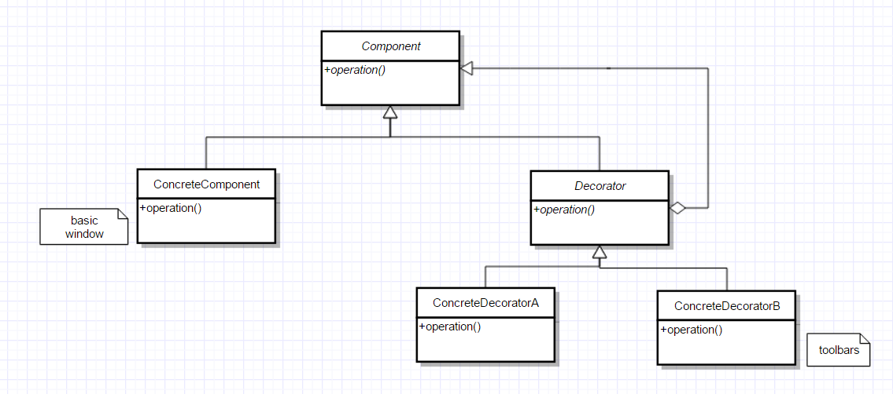
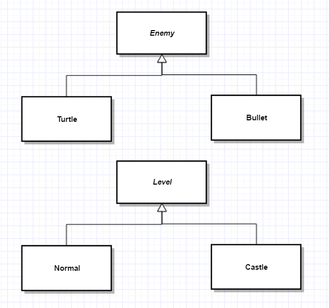

# Decorator Pattern

- suppose you want to enhance ('decorate') an object
  - add functionality at runtime (vs. compile time)

eg: basic window, enhance by adding menus, toolbars, scrollbars...



The class *Component* defines the interface (ie. operations objects provide)

- concreteComponent - implements

Decorator is a component and has a component 

​	eg: window with a menu is a kind of window, with a pointer to an underlying plain window

Decorators and ConcreateComponent 

- share a base class
- methods can be used polymorphically on them

eg: Pizza


``` c++
class Pizza {
public:
  virtual sloat price() const=0;
  virtual string desc() const=0;
  virtual ~Pizza();
};

class CrustAndSause: public Pizza {
public:
  float price() const override {return 5.99;}
  string desc() const override {return "Pizza";}
};
```

``` c++
class Decorator: public Pizza {
protected:
  Pizza *component;
public:
  Decorator (Pizza *p) : component{p} {}
  virtual ~Decorator() {delete component;}
};

class StuffedCrust: public Pizza {
public:
  StuffedCrust(Pizza *p): Decorator{p} {}
  float price() const override {return component->price+2.65;}
  string desc() const override {return component->desc+" with stuffed crust";}
}

class Topping: public Decorator{
  string theTopping;
public:
  Topping(string topping, Pizza *p): Decorator{p}, theTopping{topping} {}
  float price() const override {return component->price+0.75;}
  string desc() const override {return component->desc+" with "+theTopping;}
}
```


# Factory Method Pattern

**problem**: write a video game, 2 kinds of enemies: turtles bullets

The system randomly sends out enemies, but later levels send out more bullets



Since we never really knew what enemy is being created next, we cannot just call the ctor

- we dont want to hard-code the policy (ie. we want flexibility - difficulty add levels later)

**Factory** method to create enemies for us

``` c++
class Level {
  public:
  virtual Enemy* createEnemy=0;
  ...
};
```

``` c++
class NormalLevel: public Level {
public:
  Enemy* createEnemy() override {
    // create mostly turtles
  }
};
class Castle: public Level {
public:
  Enemy* create Enemy() override { 
    // create mostly bullets
  }
};
```

eg: usage

```c++
Level *l = new NormalLevel;
Enemy *e = l->createEnemy();
```

Factory method or "virtual constructor pattern"


# Template Method Pattern

- we want the subclass to override **source** (but not all) base class behaviour

eg: red and green turtles

```c++
class Turtle {
public:
  void draw() {
    drawHead();
    drawShell();
    drawFeet();
  }
private:
  void drawHead();
  virtual void drawShell()=0;
  void drawFeet();
}

class RedTurtle: public Turtle {
  void drawShell() override {
    // ... draw red
  }
};
class GreenTurtle: public Turtle {
  void drawShell() override {
    // draw green
  }
}
```


### Extension: Non-virtual Interface (NVI) idiom

A public virtual interface is both:

1. an interface to the client
2. an interface to subclasses

